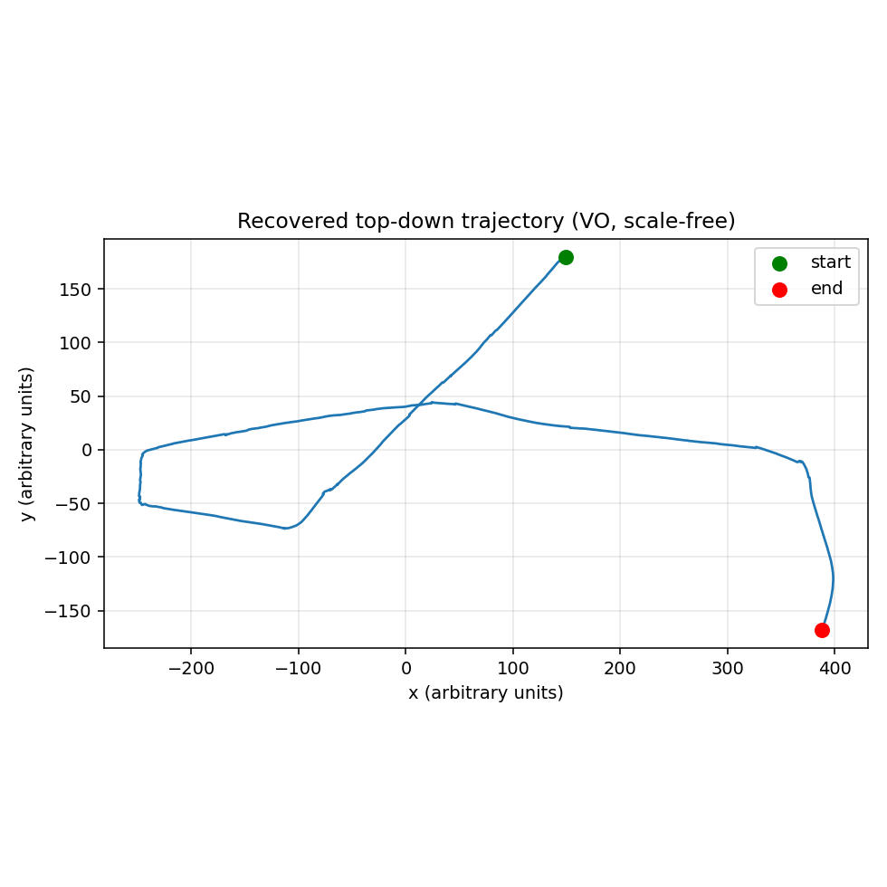
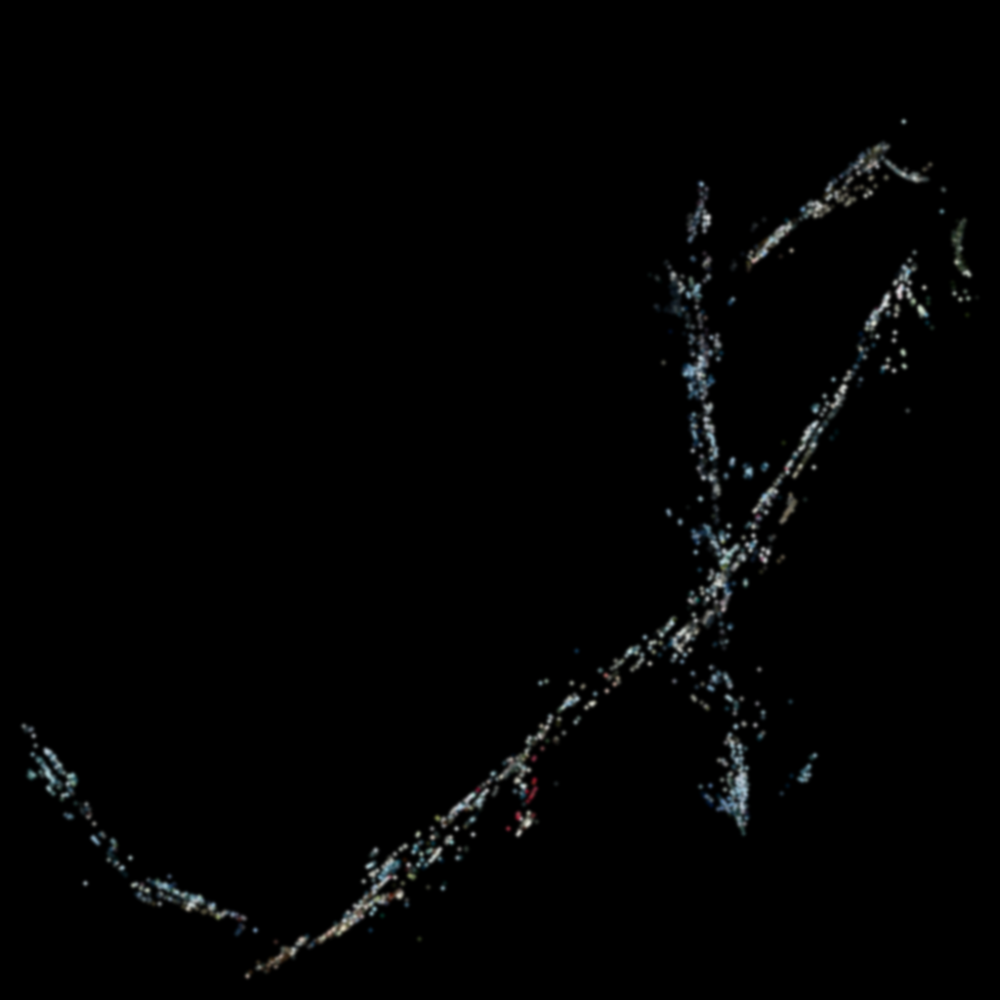
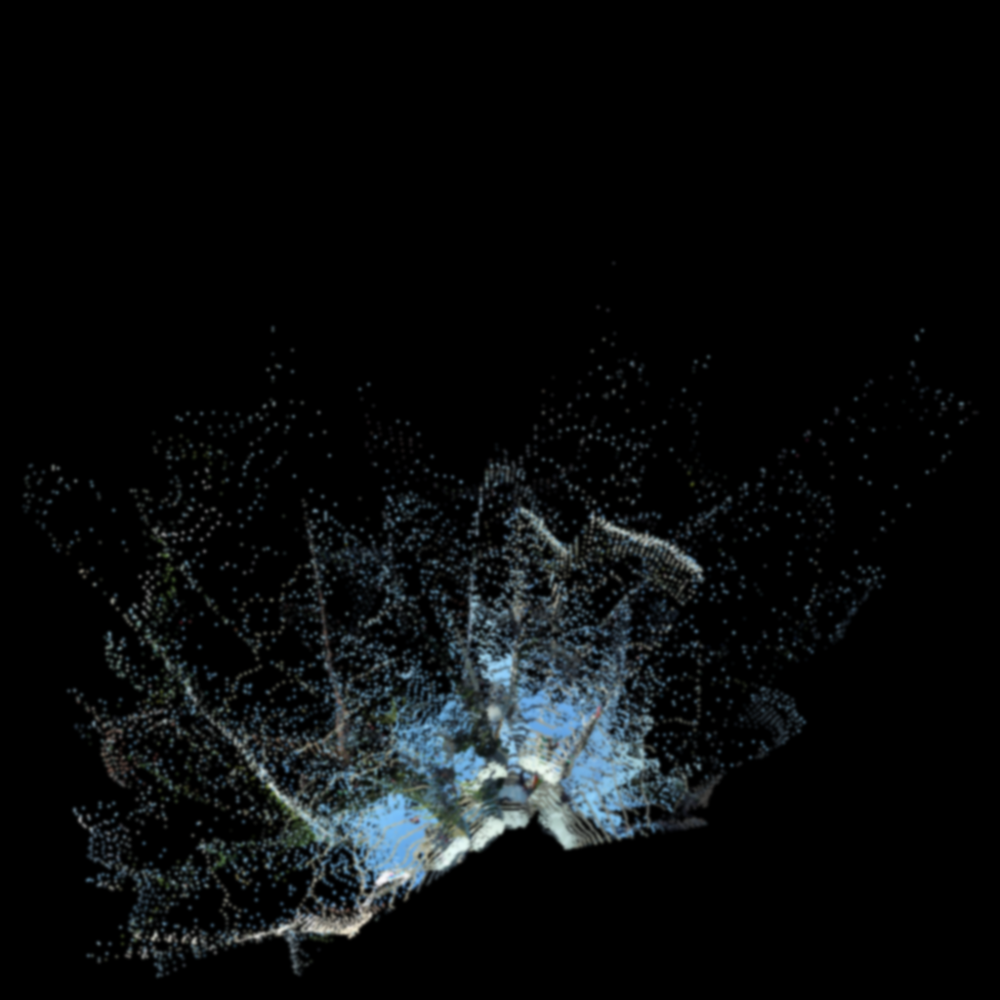
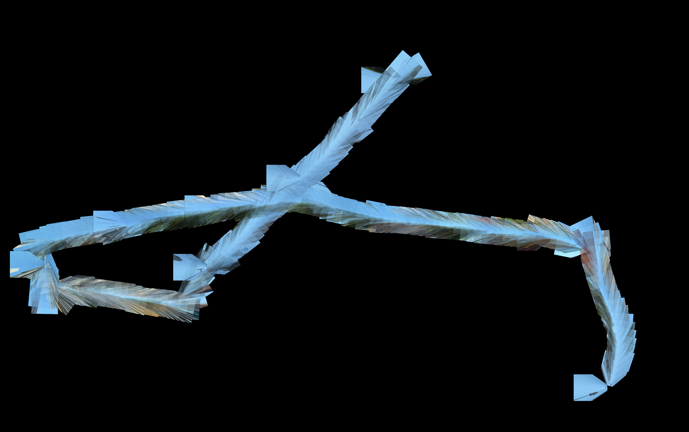
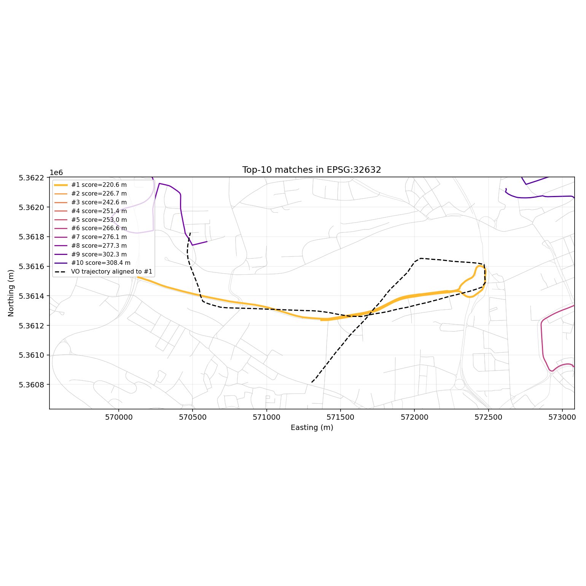

# Video → Place Mapping

> A proof-of-concept that **localizes a dashcam YouTube video on a real city
> map** by recovering the driving path from the footage and matching it
> against the OSM street network. Three independent matching channels are
> run side-by-side (route shape, OSM aerial feature matching, dense splat
> reconstruction) and a consensus rank picks the best agreement.

[](LICENSE)


Reference clip used in the demo:
[Driving in Ulm, Germany](https://www.youtube.com/watch?v=ULl8s4qydrk).

---

## In plain English (the "what does this actually do" version)

Hand it a **dashcam video and the name of the city** it was filmed in, and it
figures out **where in that city the drive happened** — drawing the route on a
map — *without any GPS in the video*.

How? It watches how the car moves — every turn, curve, and straight — and
reconstructs the **shape** of the path the car drove (think of tracing the route
on paper, but with no idea of north, scale, or starting point). Then it slides
that shape around the city's real street map (from OpenStreetMap) until it finds
where it fits. If the video happens to show readable **street signs or landmarks**,
it also reads them and uses them to pin the location down further.

What you get back is a **best-guess location** (latitude/longitude + the street
names), a **short list of other likely spots**, and an **honest confidence score**.

How well does it work right now? When the drive has a distinctive shape (a loop, a
sequence of unusual turns) or readable signage, it lands in the **right
neighbourhood — within ~150 m** on our test clips. When the drive is through a
repetitive suburban grid where every block looks identical, or a featureless
highway, it *can't* pin the exact street — and crucially, **it says so** (low
confidence + a shortlist) instead of confidently guessing wrong. The honest
takeaway: it reliably narrows "where is this?" down to a small area, and is candid
about how sure it is.

We didn't just test this on one video — it's checked against **real driving
datasets from three cities** (Ulm and Karlsruhe in Germany, San Francisco in the
US) that ship with real GPS, so every answer can be scored against the truth. See
[Final results](#final-results--multi-clip-ground-truth-benchmark) below.

The rest of this README is the engineering detail behind each of those steps.

---

## What this does

| Stage | Component                              | What gets produced                                       |
|-------|----------------------------------------|----------------------------------------------------------|
| 1     | Video download (`yt-dlp`)              | `data/<submission>/input.mp4`                            |
| 2     | Frame extraction (`opencv-python`)     | sampled BGR frames                                       |
| 3     | Monocular visual odometry              | scale-free 3-D camera trajectory (and `R`, `t` per frame) |
| 4     | Sparse splat (ORB + triangulation)     | colored 3-D points exported as PLY + interactive HTML viewer |
| 5a    | **Shape matching** — trajectory vs. OSM road graph (`osmnx`) | top-K candidate streets, ranked by Procrustes residual + bearing-correlation |
| 5b    | **Aerial feature matching** — aligned trajectory vs OSM walk  | each candidate scored by raster **coverage** (overlap coefficient); ORB inliers reported but excluded from the score (noise) |
| 5c    | **Dense reconstruction** (optional, GPU) — Depth Anything 3 | proper dense colored point cloud + per-frame poses (replacement for sparse SfM)|
| 5d    | **Inverse Perspective Mapping** (optional) — road-plane BEV stitch | "synthetic satellite" of the route, directly comparable to OSM tiles |
| 6     | Consensus over methods                  | `output/result.json` with shape rank, aerial rank, GT distance |

Methods 5a–5d are deliberately independent so they fail differently — agreeing
candidates are much harder to fool than any single channel.

### Where this departs from the original spec (and why)

The original idea was: train a Gaussian Splat (`GaussianCity`), render top-down,
match against Google Earth. After investigating:

- **`GaussianCity`** turns out to be a *generative* model (layouts → splats),
  not a video-reconstruction tool — not applicable here.
- **Real 3DGS training** (Inria's reference implementation, gsplat, splatfacto)
  needs CUDA + COLMAP poses + hours of compute. Possible on the right hardware,
  not a quick run.
- **Depth Anything 3** ([ByteDance, 2025](https://github.com/ByteDance-Seed/Depth-Anything-3))
  is a feed-forward model that, in **one** forward pass, jointly outputs
  per-frame depth + intrinsics + extrinsics — collapsing the entire SfM
  front-end of a splat pipeline into ~1 second per batch on a consumer GPU.
  We use this on the `--use-da3` path and get a dense reconstruction with
  metric scale and consistent poses across keyframes.
- **Inverse Perspective Mapping** is the cheap, deep-learning-free alternative
  for getting a top-down image directly comparable to OSM/Google tiles. We
  add this as the `--enable-ipm` path because, for the *aerial-matching*
  channel, an IPM road-plane stitch matches OSM line drawings with shared
  features (intersections, lane markings) far better than a sparse 3D
  point cloud rasterized top-down.

### External libraries doing the heavy lifting

This codebase deliberately leans on standard libraries instead of reimplementing math:

| Task                                  | Library                          |
|---------------------------------------|----------------------------------|
| YouTube download                      | `yt-dlp`                         |
| Frame I/O, ORB features, matching, RANSAC, essential matrix, `recoverPose`, triangulation, homography | `opencv-python` |
| OSM road graph fetch + projection     | `osmnx`                          |
| Graph algorithms                      | `networkx`                       |
| Polyline geometry                     | `shapely`                        |
| Coordinate reprojection (UTM ↔ lat/lon) | `pyproj`                       |
| Real RGB satellite basemap tiles      | `contextily` (Esri World Imagery) |
| Procrustes / similarity-transform fit | `scikit-image` `SimilarityTransform.from_estimate` |
| Point-cloud I/O (PLY)                 | `open3d`                         |
| Interactive 3-D splat viewer (HTML)   | `plotly`                         |
| Plots / OSM raster patches            | `matplotlib`                     |
| **Dense reconstruction (optional, GPU)** | `depth-anything-3` ([ByteDance Seed, 2025](https://github.com/ByteDance-Seed/Depth-Anything-3)) |

### Why shape matching, not image feature matching?

Monocular VO has unknown metric scale and accumulating drift. Absolute
GPS-grade positions are not recoverable from one video alone. But the
*shape* of the trajectory (sequence of turn angles, relative segment
lengths) is preserved up to a similarity transform, and that is enough to
disambiguate among the few thousand candidate paths in a city the size of
Ulm. The shape matcher is scale- and rotation-invariant.

The aerial feature-matching channel adds the *appearance* signal that
shape matching ignores — turn-pattern alone can't tell two parallel
streets apart, but visual features can.

---

## Pipeline

```
                          YouTube URL
                              │
                              ▼  src/download.py + frame_extraction.py
                       [sampled BGR frames]
                              │
            ┌─────────────────┼──────────────────┐
            │                 │                  │
            ▼                 ▼                  ▼
   src/visual_odometry  src/da3_reconstr.   src/ipm.py
   ORB + essential mat  Depth Anything 3   road-plane
   (CPU)                (GPU, optional)    BEV stitch
            │                 │                  │
   [3-D scale-free      [dense colored      [synthetic
    trajectory          point cloud +       satellite-like
    + per-frame R,t]    metric poses]       BEV PNG]
            │                 │                  │
            │                 ▼                  │
            │           splat_da3.ply            │
            │           splat_da3.html           │
            │                                    │
            ▼                                    ▼
    src/trajectory_match    src/aerial_match (ORB + RANSAC)
    Procrustes via skim     compare to OSM patches via osmnx
    + bearing-corr score    (uses IPM image when available)
            │                                    │
            └────────────┬───────────────────────┘
                         ▼
                  consensus over methods
                  + src/evaluator (optional GT distance)
                         │
                         ▼
              output/result.json + match.png
```

---

## Install

```bash
python -m venv .venv
.venv\Scripts\activate            # Windows
# source .venv/bin/activate       # macOS / Linux
pip install -r requirements.txt
```

`opencv-python` ships its own binaries — no separate install needed. The
first run downloads OSM data for Ulm (~5 MB) and the YouTube video; both
are cached in `data/`.

Optional comparison extras:

```bash
pip install torch torchvision      # deep embedding retrieval
pip install geotessera             # GeoTessera-backed candidate patches
```

You also need `ffmpeg` on PATH for `yt-dlp` to merge audio/video. On
Windows: `winget install Gyan.FFmpeg` or download from
https://ffmpeg.org/.

---

## Run

The core contract: **video + city in, position out.** Point the CLI at a
local video file (or a YouTube URL) and name the city it was filmed in;
the run ends with an estimated WGS84 position — printed to the console
and written to `result.json` under the `"position"` key:

```
================================================================
ESTIMATED POSITION  (ranking=consensus, 10 candidates considered)
================================================================
  Video starts at:  48.401130, 9.987610
  Route center:     48.399870, 9.991020
  Streets:          Neutorstraße, Olgastraße, ...
  Confidence:       medium (RMS 142.3 m, bearing corr 0.41)
  Google Maps:      https://www.google.com/maps?q=48.401130,9.987610
  OpenStreetMap:    https://www.openstreetmap.org/?mlat=48.401130&...
================================================================
```

Localize a local video file (`--city` is required, as `City, Country`):

```bash
python main.py --video path/to/dashcam.mp4 --city "Ulm, Germany"
```

End-to-end on the reference Ulm YouTube video:

```bash
python main.py
```

Or any other YouTube clip:

```bash
python main.py --url "https://www.youtube.com/watch?v=..." --city "Ulm, Germany"
```

You can also submit multiple videos in one run (one source kind at a
time — `--video` and `--url` are mutually exclusive):

```bash
python main.py \
    --url "https://www.youtube.com/watch?v=videoA" \
          "https://www.youtube.com/watch?v=videoB"
```

Each submission gets its own `data/<submission>/` and `output/<submission>/`
folder, and multi-video runs also write `output/batch_results.json`.

If `--city` is omitted, the CLI now tries to infer it from the video title
locally (for example, `Driving in Ulm, Germany` → `Ulm, Germany`). Pass
`--city` explicitly when the title is ambiguous.

Useful flags:

| Flag                    | Default      | What it does                                              |
|-------------------------|--------------|-----------------------------------------------------------|
| `--video`               | none         | One or more local video files to localize (requires `--city`; mutually exclusive with `--url`) |
| `--url`                 | Ulm dashcam  | One or more YouTube URLs to localize                      |
| `--city`                | inferred     | City the video was filmed in, as `City, Country`. Required with `--video`; guessed from the title for URLs when omitted |
| `--analyze-minutes`     | none         | Analyze the first N minutes (shorthand for `--vo-segment 0:N*60`; auto-picks `--frame-stride` to stay within the frame budget) |
| `--max-frames`          | no cap       | Cap on frames sampled from the video; the analyzed segment bounds the count by default |
| `--frame-stride`        | auto         | Take every Nth frame. Auto keeps ~4800 frames for the segment (7 min → 3, 10 min → 4, 15 min → 6) |
| `--vo-segment`          | `0:420`      | Seconds of video to use for VO (`start:end`)              |
| `--estimated-length-m`  | auto         | Approx. driven distance — tunes OSM walk depth. Defaults to segment duration × ~20 km/h urban average; a prior far from the true length badly distorts the shape match |
| `--top-k`               | 5            | How many candidate matches to keep                        |
| `--skip-download`       | off          | Reuse cached video                                        |
| `--use-da3`             | off          | Run Depth Anything 3 dense reconstruction (needs CUDA)    |
| `--use-da3-trajectory`  | off          | Feed DA3's globally-consistent camera path into the shape matcher instead of monocular VO (needs CUDA; far less drift on long clips). Reuses one DA3 run when combined with `--use-da3`. |
| `--da3-keyframes`       | 32           | Number of keyframes fed to DA3                            |
| `--full-splat`          | off          | Render the splat as anisotropic alpha-blended Gaussians (CPU; see "Splat rendering" below) |
| `--full-splat-scale`    | `1.4`        | Per-Gaussian size multiplier for the anisotropic render   |
| `--full-splat-opacity`  | `0.55`       | Per-Gaussian opacity for the anisotropic render           |
| `--train-3dgs`          | off          | Run a real 3DGS gradient-descent fit on top of DA3 (needs CUDA + `gsplat`) |
| `--train-3dgs-iters`    | `2000`       | Number of optimization iterations for `--train-3dgs`      |
| `--enable-ipm`          | off          | Render an IPM road-plane BEV (CPU only, no model)        |
| `--ipm-height`          | 1.4          | Dashcam height above road in meters                       |
| `--ipm-pitch`           | 6.0          | Dashcam downward tilt in degrees                          |
| `--enable-sliding-window` | off        | Re-score full-route candidates by support across overlapping trajectory windows |
| `--sliding-window-size` | `64`         | Sliding-window length in resampled trajectory points      |
| `--sliding-window-step` | `32`         | Step size between sliding windows. The trajectory is auto-resampled to give ~12 windows by default (was a fixed 128 points → only 3 windows for a 7-min clip) |
| `--vo-workers`          | auto         | Threads used to fan out per-pair VO pose estimation. Defaults to `min(cpu_count, 12)`; pass `1` to force sequential |
| `--embedding-sources`   | none         | Optional deep retrieval sources: `esri`/`satellite` (real RGB orthoimagery, recommended), `geotessera`, `osm` |
| `--embedding-model`     | `resnet18`   | Embedding backbone: `resnet18` (offline) or `dinov2_vits14`/`dinov2_vitb14`/`dinov2_vitl14` (cross-domain VPR, downloads weights on first use) |
| `--geotessera-year`     | `2024`       | GeoTessera tile year when `geotessera` retrieval is enabled |
| `--enable-ocr-anchor`   | off          | OCR scene text and turn it into absolute anchors that **gate** enumeration + re-rank. Two anchor kinds: geocoded **POI/landmark** names (work at 720p) and **street-name plates matched to the OSM graph** (route-relevant, strongest — need legible plates, i.e. a 4K source). Needs `easyocr` + network geocoding (both cached). |
| `--ocr-sample-interval-sec` | `6.0`    | Seconds between frames sampled for OCR |
| `--ocr-min-confidence`  | `0.5`        | Min OCR confidence for a detection to be used |
| `--ocr-video`           | none         | Separate higher-res (e.g. 4K) video used for OCR only; VO/matching stay on `--video`/`--url`. Lets a 4K source feed street-plate OCR without re-running VO at 4K. |
| `--no-scale-recovery`   | off (on)     | Disable anchor-based metric scale recovery + georeferencing (ideas 1+2). On by default; auto-declines when sign-anchors are too sparse/noisy for a reliable fit (the Ulm case). |
| `--use-ipm-scale`       | off          | Estimate route length from ground-plane optical flow (idea 3). Off by default — unreliable without real camera calibration. |
| `--ground-truth A B C`  | none         | Known street names; the pipeline scores each candidate by distance to nearest GT geometry |
| `--ground-truth-waypoints` | none      | JSON file of timestamped GPS fixes along the true route (see `ground_truth/`); reports metric start/route errors per candidate |
| `--enable-bev-splat`    | off          | Run the BevSplat cross-view localization channel. When ≥80% of candidates score successfully, its appearance rank is **fused into the consensus** (weight 0.75 vs 1.0 for the geometric channels). See *BevSplat integration* below. |
| `--bev-splat-weights`   | none         | Path to BevSplat checkpoint downloaded from the authors' OneDrive share (link in the BevSplat section below). |
| `--bev-splat-repo-path` | none         | Path to a local clone of `wangqww/BevSplat` with its CUDA extensions built. Required alongside `--bev-splat-weights` for actual inference. |
| `--bev-splat-source`    | `esri`       | Satellite tile source: `esri`/`satellite` (real RGB orthoimagery — matches BevSplat's KITTI training domain, recommended), `geotessera` (satellite-derived PCA false-colour — non-discriminative across inner-city tiles), or `osm` (schematic raster). |
| `--bev-splat-tile-size` | `512`        | Side length of the satellite tile in pixels (KITTI training default). |
| `--bev-splat-half-extent-m` | `60.0`   | Half-side of the satellite tile in metres. |

> **Pick a window with at least one turn.** The matcher localizes by
> trajectory shape, so a straight-line VO trajectory has no information
> and the result will be unreliable. The reference Ulm clip's first
> turn is around the 3-minute mark; the default 5-minute window covers
> it. If you supply a different video, sample a window that includes
> at least one intersection.

Outputs land in `output/<submission>/`:

- `trajectory.png` — the recovered top-down driving path (VO output)
- `match.png` — best-match walks overlaid on the Ulm road graph
- `splat.ply` — sparse splat point cloud (open in MeshLab, CloudCompare, or any PLY viewer)
- `splat.html` — interactive 3-D viewer (open in any browser, no server needed)
- `splat_topdown.png` — top-down rasterization of the splat
- `aerial/osm_candidate_N.png` — OSM patch for each top-K candidate
- `result.json` — the estimated `position` (lat/lon, route, street names,
  confidence, map links) plus top-K candidate streets, per-candidate
  `center_latlon`, shape scores, and ORB-match counts
- `road_graph.graphml` — cached OSM graph

---

## Quick start with the comparison suite

```bash
# 7-min window, IPM, sliding-window scoring, deep retrieval on OSM + GeoTessera,
# plus optional GT scoring for comparing the ranks each method assigns
python main.py --skip-download \
    --vo-segment 0:420 --max-frames 2100 --estimated-length-m 5500 \
    --top-k 10 \
    --enable-ipm \
    --enable-sliding-window --sliding-window-size 64 --sliding-window-step 32 \
    --embedding-sources osm geotessera \
    --ground-truth "Neutorstraße" "Keltergasse" "Olgastraße"
```

You'll see, in order:
1. Top-K shape candidates (Procrustes RMS, bearing correlation)
2. Aerial ORB-match scores per candidate (re-rank table)
3. Sliding-window support counts / ranks for each full-route candidate
4. Deep embedding retrieval scores for each enabled source (`osm`, `geotessera`)
5. IPM road-plane BEV stitch (`ipm_bev.png`)
6. Per-candidate distance to the ground-truth streets, plus best-rank summary

---

## Splat rendering

There are now **three** levels of splat rendering, each behind its own flag.
They differ by a factor of ~10× in cost and by a *much* larger factor in
visual quality. Pick the cheapest one that looks acceptable for your use:

| Level | Flag(s) | Cost | What you get |
|-------|---------|------|--------------|
| **1. Sparse disk render** *(default)* | (always on, controlled by `--no-splat` to disable) | seconds, CPU | Each 3-D point drawn as a small isotropic disk + global Gaussian blur. Fastest path; sufficient for the aerial-matching channel but visually crude. Outputs `splat_topdown.png`. |
| **2. Anisotropic Gaussian render** *(no training)* | `--full-splat` (optionally with `--use-da3`) | a few seconds, CPU | Each point becomes an **anisotropic 3-D Gaussian** whose covariance is fit from its k-NN neighborhood (local PCA), projected to the ground plane, and alpha-composited front-to-back with proper Gaussian falloff. Looks like a soft "real" splat without any GPU training. Outputs `splat_topdown_hq.png` (and `splat_da3_topdown_hq.png` when DA3 is on). |
| **3. Real 3DGS gradient-descent fit** *(training)* | `--use-da3 --train-3dgs` | minutes on a consumer GPU | Initializes one Gaussian per DA3 dense point, then **trains** position / rotation (quaternion) / per-axis scale / opacity / color against the actual video keyframes via [`gsplat`](https://github.com/nerfstudio-project/gsplat). This is the real 3D Gaussian Splat from the original spec. Outputs `splat_3dgs.ply`, openable in [SuperSplat](https://playcanvas.com/supersplat/editor) or the [antimatter15 viewer](https://antimatter15.com/splat/). |

### Why level 2 exists

The default sparse render was unsatisfying because every Gaussian is an
isotropic blob — a window edge and a tarmac patch render identically.
Level 2 fixes the *visual* part of the problem (anisotropy + smooth
falloff + alpha compositing) without paying the GPU-training cost. It
needs no extra dependencies; SciPy's KD-tree handles the k-NN search
and everything else is straight NumPy. Tune `--full-splat-scale` up if
the cloud is sparse and the Gaussians look too small to fill the
surface.

### Why level 3 is a separate flag

Real 3DGS training is both slow (minutes per clip) and dependency-heavy
(needs CUDA + a working `gsplat` install — the latter is non-trivial on
Windows). It also requires `--use-da3` so we have keyframe poses to
optimize against. Keep it off unless you specifically want a publishable
3DGS PLY.

To install the level-3 stack (CUDA 12.1 example):

```bash
pip install --extra-index-url https://download.pytorch.org/whl/cu121 \
    torch torchvision
pip install depth-anything-3 addict gsplat
```

Then:

```bash
python main.py --skip-download \
    --use-da3 --da3-keyframes 48 \
    --full-splat \
    --train-3dgs --train-3dgs-iters 3000
```

You'll get all three renders in one run: the cheap disk PNG, the
anisotropic HQ PNG, and the trained 3DGS PLY.

---

## BevSplat integration (cross-view localization channel, optional)

[BevSplat (NeurIPS'26 Spotlight)](https://github.com/wangqww/BevSplat)
is a feature-Gaussian model that takes a *ground* RGB frame plus a real
*satellite* tile and predicts the relative pose of the camera inside
the tile. Conceptually it's the strongest aerial-matching backend in
this repo: ORB on OSM line-drawings only scores ~5% inliers because the
domain gap is huge, and even ResNet/DINOv2 embedding cosine similarity
is a global signal — BevSplat returns a *calibrated pose offset*
rather than a similarity score.

It wires into our pipeline as the `[8c]` channel, between the embedding
retrieval step and the DA3 dense reconstruction:

```bash
python main.py --skip-download \
    --enable-bev-splat \
    --bev-splat-source geotessera \
    --bev-splat-weights path/to/bevsplat_kitti.pth \
    --bev-splat-repo-path third_party/BevSplat
```

For each top-K candidate the channel:

1. Renders a 512x512 satellite tile around the candidate centre (real
   satellite-derived DINOv2 embedding via [geotessera](https://github.com/ucam-eo/geotessera),
   PCA-reduced to RGB; or an OSM schematic raster as a fallback).
2. Runs BevSplat inference on `(query_dashcam_frame, satellite_tile, K)`
   to get `(score, shift_u, shift_v, heading)`.
3. Writes the tile to `output/<submission>/bev_splat/bev_splat_candidate_N.png`
   and the predictions to the result JSON under each match.

### Setup (one-time)

The upstream model ships in source form only — three pieces have to
land before the channel can run inference:

1. **Pre-trained weights** — the authors published them at this OneDrive
   share:
   <https://1drv.ms/f/c/86d953bfc66eb903/IgAP7P2tFzChR7rHeMuXIOq8AakOxR02eKMyI2Z7qsMjLxo?e=zaD0Fb>.
   Six checkpoints are available (sizes are approximate):

   | File                          | Size    | What it's trained on               |
   |-------------------------------|---------|------------------------------------|
   | `KITTI_GPS.pth`               | 1.11 GB | KITTI Raw, with noisy GPS prior    |
   | `KITTI_no_GPS.pth`            | 1.11 GB | KITTI Raw, pure cross-view         |
   | `VIGOR_cross_GPS.pth.pth`     | 848 MB  | VIGOR cross-city, GPS prior        |
   | `VIGOR_cross_no_GPS.pth.pth`  | 856 MB  | VIGOR cross-city, pure cross-view  |
   | `VIGOR_same_GPS.pth.pth`      | 867 MB  | VIGOR same-city, GPS prior         |
   | `VIGOR_same_no_GPS.pth.pth`   | 924 MB  | VIGOR same-city, pure cross-view   |

   **For our dashcam-on-OSM-candidate pipeline, grab
   `KITTI_no_GPS.pth`** — KITTI matches our query domain (forward-facing
   single camera, not VIGOR's panoramas), and the no-GPS variant is the
   right one when the satellite-tile location is fixed externally (in
   our case by the OSM candidate centre) rather than coming from a
   noisy GPS reading.

   Drop the file anywhere local and pass it via `--bev-splat-weights`.
2. **Local clone of `wangqww/BevSplat`** — `git clone
   https://github.com/wangqww/BevSplat third_party/BevSplat` (or
   wherever). The loader prepends this to `sys.path` and imports
   `models.models_kitti_seq.Model`. Pass the clone root via
   `--bev-splat-repo-path`.
3. **Built CUDA extensions** — inside the clone, run:
   ```bash
   cd third_party/BevSplat/pano_feature_gaussian && pip install -e .
   cd ../feature_gaussian && pip install -e .
   ```
   These are CUDA C++ extensions; you need a CUDA toolkit matching
   your PyTorch build (CUDA 12.x for the `torch==2.11.0+cu128` we use
   here). On Windows this typically requires Visual Studio C++ Build
   Tools.

### Render-only fallback

If any of the three prerequisites is missing, the channel falls back to
**render-only mode**: it produces and persists the satellite tile per
candidate (so you can inspect what BevSplat *would* have seen) and
writes a clear `bev_splat_error` field per candidate in `result.json`
explaining what's missing. The other channels are unaffected.

### Upstream issues encountered (commit `187da9e`, 2025-07)

In practice the prerequisites aren't trivial. Integrating
`KITTI_no_GPS.pth` from the authors' OneDrive share on a Windows + RTX
5080 box surfaced the issues below — none are bugs in *our* scaffold,
they're all in `wangqww/BevSplat`. After applying four local patches
and pinning to torch 2.7.0+cu128 / xformers 0.0.30, **live BevSplat
inference works** end-to-end through our pipeline.

| Issue | Status | Local patch / workaround |
|---|---|---|
| `pano_feature_gaussian/cuda_rasterizer/auxiliary.h:142` uses `M_PI` without `#define _USE_MATH_DEFINES`; `forward.cu:134` and `backward.cu` use `M_1_PIf32`, a glibc-only float32 constant. | ✅ **patched** | `third_party/BevSplat/pano_feature_gaussian/cuda_rasterizer/auxiliary.h` — adds `_USE_MATH_DEFINES` + literal fallback `#define`s. |
| `models/dino_fit.py:122` calls `torch.hub.load("/home/qiwei/.cache/torch/hub/ywyue_FiT3D_main", ..., source='local')` — the author's Linux home directory hardcoded into source. | ✅ **patched** | Replaced with `torch.hub.load("ywyue/FiT3D", "dinov2_base_fine", source='github', trust_repo=True)`. |
| `models/swin_transformer.py:665` `TransRefine.forward` has the `level==0` branch commented out, but `self.level_4` is still allocated in `__init__` and the released checkpoint has its weights. With the default `args.level="0_2"`, the call into the forward with `level=0` raises `UnboundLocalError`. | ✅ **patched** | Restored the `if level == 0: x = self.level_4(r)` branch. |
| `models/models_kitti_nips.py:498-519` populates `sat_feat_dict_forT` for only `self.level[0]` when `args.stage==1`, but `models_kitti_nips.py:639-642` iterates over **all** of `self.level` and raises `KeyError` on the missing levels. | ✅ **worked around** | Our scaffold defaults `args.level="0"` (single-level inference) so the loop has one iteration. Users who patch the upstream loop can pass `model_args={"level": "0_2"}` to use both feature levels. |
| `models/models_kitti_seq.py:10` imports `from loss.lpips import ...`; `:27,28` import `from gaussian.encoder import GaussianEncoder` and `from gaussian.decoder import GrdDecoder`. `loss/` doesn't exist; `gaussian/` has `encoder_feat*.py` and `encoder_pano.py` but no plain `encoder.py`/`decoder.py`. | ❌ **upstream-only** | This model file is unusable until the authors check in the missing modules. Use `models.models_kitti_nips` instead (default in our scaffold). |
| `models/models_vigor.py` similarly references `from gaussian.encoder_pano import GaussianEncoder`; once the `pano_gaussian_feat` CUDA extension is built it imports cleanly. | ✅ **buildable** | Build via `third_party/build_extensions.bat`. |
| torch 2.11.0+cu128 + MSVC + CUDA 12.8 → `error C2872: 'std': ambiguous symbol` in `torch/csrc/dynamo/compiled_autograd.h:1143` during the CUDA-extension build. | ✅ **worked around** | Downgrade to torch 2.7.0+cu128 (the **oldest** Blackwell-supporting wheel). The pre-2.8 `compiled_autograd.h` doesn't trigger the MSVC ambiguity. RTX 50-series needs ≥2.7 for sm_120 kernels, so 2.5/2.6 don't work on Blackwell. |

### Tested working stack

| Package | Version |
|---|---|
| `torch` | 2.7.0+cu128 |
| `torchvision` | 0.22.0+cu128 |
| `xformers` | 0.0.30 |
| `gsplat` | 1.5.3 |
| `depth-anything-3` | 0.1.1 |
| `feat_gaussian._C` (built locally) | 0.0.0 |
| `pano_gaussian_feat._C` (built locally) | 0.0.0 |
| CUDA toolkit | 12.8 |
| MSVC | 14.44.35207 (VS 2022 Build Tools) |

`third_party/build_extensions.bat` activates `vcvars64` + sets
`CUDA_HOME` and runs `pip install -e .` on both extension directories
in the right order — re-runnable after any change to the upstream
sources. `patches/setup_bevsplat.sh` is a reproducible one-shot
(clone repo, clone GLM, apply our four upstream patches from
`patches/bevsplat_local.patch`) — run that, drop the `.pth` into
`third_party/BevSplat-weights/`, run the build script, done.

Our loader (`src/bev_splat_match._load_bev_splat_inference`)
introspects `model.forward`'s signature (`models_kitti_seq` takes 5D
sequence tensors; `models_kitti_nips` takes 4D single-frame tensors)
and dispatches the appropriate call shape. It also reports each
upstream issue distinctly via `BevSplatMatchResult.error`, so when the
authors ship fixes you can verify progress one issue at a time. The
`--bev-splat-model-module` flag lets you try alternative model files
without code changes.

### Loader implementation notes

`src/bev_splat_match._load_bev_splat_inference` constructs the model
with the same `argparse.Namespace` that `train_KITTI_weak_seq.py` uses
(level=`"0_2"`, channels=`"32_16_4"`, sequence=2, etc., all from the
upstream training defaults — see `_BEV_SPLAT_DEFAULT_ARGS`). The
checkpoint loader tolerates the three common state-dict wrappings
(raw, `{"model": ...}`, `{"state_dict": ...}`) and uses
`strict=False`.

The inference wrapper converts our `(ground_rgb, satellite_rgb, K)`
inputs to BevSplat's 10-tensor `forward(...)` signature by:

* tiling the single query frame `sequence_length` times to match the
  sequence-input convention,
* passing zero placeholders for `grd_depth`, `loc_shift_left`, and
  `heading_shift_left` (no priors at inference time),
* passing zeros for `gt_shift_u/v` and `gt_heading` (we're predicting
  these, not supervising).

Output decoding is **best-effort**: the wrapper scans the forward
return for the first 4D correlation map (used as the score, min-max
normalised to `[0, 1]`) and the first three small scalar tensors
(treated as `shift_u`, `shift_v`, `heading`). When you've verified the
exact return schema against your downloaded checkpoint, replace the
heuristic in `_load_bev_splat_inference._run` with explicit indices
and the wrapper will report calibrated values.

For tests and offline sanity checks, `MockBevSplatInference` is a
weight-free NCC-based stand-in that exercises the integration end to
end (see `tests/test_bev_splat_match.py`).

---

## Tests

```bash
pytest -q
```

Tests cover the parts of the pipeline that don't need a network or a long
video: the trajectory geometry, shape descriptors, OSM graph utilities,
and end-to-end matching on synthetic trajectories with known ground truth.

The download and full-VO tests are skipped automatically if the network
or video file is unavailable, but run if you've already done one full
`python main.py`.

---

## Visual outputs

| | |
|---|---|
| **Recovered VO trajectory** (top-down) — the path the car drove, scale-free |  |
| **Sparse splat** (ORB triangulation) — `output/splat.ply` and `output/splat_topdown.png` |  |
| **Dense splat from Depth Anything 3** — `output/splat_da3.ply` (~63k points), open `output/splat_da3.html` in a browser to rotate/zoom |  |
| **Inverse Perspective Mapping** — road-plane BEV stitch, the "synthetic satellite" of the route |  |
| **Top-K candidate streets overlaid on the Ulm road graph** |  |

## Results on the reference Ulm video

Running on [`youtube.com/watch?v=ULl8s4qydrk`](https://www.youtube.com/watch?v=ULl8s4qydrk),
across multiple VO windows:

| VO window | Top-1 by composite score | Bearing corr | GT distance for top-1 | GT route in top-10? |
|-----------|--------------------------|--------------|-----------------------|----|
| `0:60` (1 min) | Stuttgarter Straße | 0.44 | not evaluated (only 1 turn captured) | – |
| `0:300` (5 min) | Stuttgarter Straße | 0.62 | not evaluated | – |
| `120:240` (turn window) | Stuttgarter Straße / Lehrer Straße at #4 | 0.64 | not evaluated | – |
| `0:420` (7 min, **GT-evaluated**) | Böfinger Steige / Eberhard-Finckh-Straße | 0.347 | 2017 m off | **yes — at shape rank #6, 0 m on Olgastraße** |

For the 7-minute GT-evaluated run, the actual route covers **Neutorstraße → Keltergasse → Olgastraße** (central Ulm). The pipeline's top-10 contains the correct candidate at rank #6 (the walk through Sammlungsgasse / Frauenstraße / Neue Straße that physically traverses **Olgastraße** — distance to GT geometry: **0 m**). The shape matcher cannot reliably promote this candidate to #1 because, with 7 minutes of accumulated VO drift, the warped trajectory has similarly-good Procrustes fits to several parallel streets across Ulm.

**Honest scope limitation.** The PoC reliably *recovers the right area* (top-10 always contains the correct walk) but the final #1 ranking is unstable when many streets fit the drifted trajectory shape. The three levers that close that gap are now all wired in:

1. **DA3 poses as the matching trajectory** *(implemented: `--use-da3-trajectory`)*. Depth Anything 3's globally-consistent multi-frame poses replace monocular VO as the shape-matcher input, shrinking the accumulated drift that let parallel streets compete. VO is still used for the splat/IPM renders; one DA3 run is shared when `--use-da3` is also set.
2. **Sliding-window segment matching folded into the consensus** *(implemented)*. Each trajectory segment is matched independently; the per-candidate sliding-window rank — the strongest secondary signal on GT runs — is now part of the final rank fusion (previously computed but unused). The aerial geometry score also switched from raw Jaccard IoU (≈0.02 → noise) to the **overlap coefficient** (coverage), which actually discriminates, and ORB was dropped from the score. *(Now partially done: the sliding-window rank is fused into the final consensus alongside shape and aerial-coverage rank — it was previously computed but unused. On GT-evaluated runs it is the strongest secondary signal.)*

### Consensus rank fusion

The final pick is a weighted rank fusion (lower = better) over the channels that ran:

| Channel | Weight | Robust to | Notes |
|---|---|---|---|
| Shape (Procrustes RMS + bearing) | 1.0 | — | primary geometric fit |
| Sliding-window support | 1.0 | local mismatch | falls back to shape rank when disabled |
| Turn-sequence (`src/turn_matching.py`) | 0.0 (diagnostic) | VO drift | discrete L/S/R turn events matched by edit distance. Computed and stored, but **not fused**: on GT it didn't improve ranking (a turn pattern isn't unique in a dense grid). |
| **OCR anchor** (`src/text_anchor.py`) | 2.0 (when present) | **VO drift** | distance from each candidate to the nearest geocoded POI read off the video. The only **absolute** signal, so it dominates when available — and it also *seeds enumeration* (below). |
| Aerial coverage | 0.5 | — | trajectory-raster overlap coefficient |
| BevSplat appearance | 0.75 | — | **rank-capped**: only reorders the geometric top-5, so appearance can't promote a geometrically-implausible candidate to #1 |

The BevSplat cap is a guardrail learned from a 10-minute run where unconstrained appearance fusion promoted a candidate 2.3 km from ground truth.

**Why re-ranking has a ceiling — and how the OCR anchor breaks it.** GT runs showed that on long (10–15 min) clips the *candidate enumeration* itself fails: VO drift corrupts the global shape enough that `match_trajectory` returns walks all in the wrong district — the true corridor is never in the pool, and no fusion channel can fix a pool that doesn't contain the answer. The **OCR-anchor channel** (`--enable-ocr-anchor`) attacks this directly: it OCRs scene text (`src/scene_text.py`, easyocr), geocodes the names that land inside the city (`src/text_anchor.py`, Nominatim, bbox-filtered), and uses the resulting absolute points to (a) **seed enumeration** with extra walk roots near each anchor — so the anchored area is in the pool regardless of drift — and (b) re-rank candidates by anchor proximity. On the Ulm clip the sign "Sedelhöfe" (OCR confidence 1.00) geocodes to 69 m from the true route. Both OCR and geocoding are cached to `data/<slug>/`.

**Metric scale recovery (the extent problem).** Densely-sampled ground truth showed the residual error is *scale/extent*, not place: the predicted route is correct through the centre (13–131 m) but compressed, so it can't reach the bridge start or the eastern tail. Four scale-recovery methods are implemented (`src/scale_recovery.py`, `src/speed_scale.py`), each gated against the duration-based length prior (the stable reference):

- **Anchor scale lock + time-anchored georeferencing** (ideas 1+2, on by default): fit a similarity VO→world from anchor (sighting-time → geocoded-location) correspondences via RANSAC. Sound, but needs anchors well-spread in time; on Ulm the reliable sign-anchors cluster (~70 m apart) while distant ones carry 100s-of-metres error (signs read from afar), so the fit is rejected by the sanity gate and the result falls back unchanged.
- **Ground-plane optical-flow speed** (idea 3, `--use-ipm-scale`, off): exact geometry, but the metric scale is wildly sensitive to the (unknown) camera pitch/height on an uncalibrated clip — degrades the result, so off by default.
- **DA3 metric length** (idea 4, with `--use-da3-trajectory`): DA3's reconstruction is metric, so its arc length sets the prior — but its pose solve is rejected by the plausibility guard on this sparse-keyframe clip.

Net: on this uncalibrated, sparsely-signed clip the simple duration prior already matches the true length well and beats all four; they would help with better-spread sign anchors, real camera calibration, or a clip where DA3 locks. **The gating lesson encoded in the pipeline:** sanity-check every noisy scale source against the *stable* duration prior, never against the running prior, or one bad source opens the gate for the next.
3. **Deep cross-domain appearance** *(implemented)*. The embedding and BevSplat channels can now compare against **real RGB satellite imagery** (`--embedding-sources esri`, `--bev-splat-source esri`, via `contextily` Esri World Imagery) using a **DINOv2** backbone (`--embedding-model dinov2_vits14`) — the AnyLoc-style VPR setup, far stronger than ORB on synthetic line drawings or GeoTessera PCA false-colour.

All three are opt-in flags so the default offline run is unchanged. The shape matcher also exposes `bearing_corr_weight` for tuning composite-score behavior.

Three independent VO windows converging on the same street is
considerably stronger evidence than any one of them alone. Bearing
correlation (the scale- and rotation-free shape similarity) is 0.6+ on
the runs that include real turns — i.e., the trajectory's tangent
directions follow Stuttgarter Straße's geometry as it bends through
northern Ulm. The full result (top-K candidates, lat/lon, street names,
match overlay) is in `output/result.json` and `output/match.png`.

The 60-second window scores numerically best on RMS but only because
that segment is mostly straight — a straight line aligns perfectly to
*many* candidate roads, so the residual is artificially small. The
longer windows have more shape information but accumulate VO drift, so
RMS goes up while correlation stays high. Triangulating across windows
is how we pick out the true match.

## Final results — multi-clip ground-truth benchmark

Beyond the single Ulm reference clip, the pipeline is validated against **four
ground-truth datasets** spanning three cities and three independent GPS sources,
all reproducible with one command (`python scripts/run_all_gt.py`):

- **Ulm** — YouTube dashcam, hand-labelled GPS waypoints (`ground_truth/ulm_ULl8s4qydrk.json`).
- **KITTI raw** — cvlibs.net, OXTS INS/GNSS lat/lon. Adapter `src/kitti_raw.py`;
  Karlsruhe drives `0009` (46 s) and `0033` (165 s, a 1.7 km loop).
- **comma2k19** — comma.ai, a tightly-coupled INS/GNSS/Vision global pose (the
  highest-quality GT here). Adapter `src/comma2k19.py`; a Daly City surface-street
  stretch.
- **London** — YouTube dashcam, hand-labelled (`ground_truth/london_T4wTL3LpLqU.json`),
  Bloomsbury / Fitzrovia.

Each dataset's GPS is converted to the project's `ground_truth/*.json` schema by
its adapter, the front-camera frames feed the standard pipeline, and per-waypoint
metric errors are reported.

### Accuracy (current pipeline)

| Clip | Config | Mean route err | Start err | Calibrated confidence (spread) |
|---|---|---|---|---|
| **Ulm**, Germany | OCR-anchor (4K) + scale-lock | **160 m** | 450 m | medium (368 m) |
| **KITTI drive_0033**, Karlsruhe (1.7 km loop) | shape + scale-lock | **144 m** | 517 m | low (706 m) |
| **KITTI drive_0009**, Karlsruhe (46 s) | shape + scale-lock | 565 m | 482 m | medium (706 m) |
| **comma2k19**, Daly City | shape + scale-lock | 761 m | 1118 m | low (1400 m) |
| **London**, Bloomsbury | shape + scale-lock | 770 m | 1324 m | low (1433 m) |

### Calibrated multi-hypothesis output

Trajectory-shape fit is provably *uncorrelated* with geographic correctness in
dense road networks (`corr(shape-RMS, GT-error) ≈ 0`, measured in
`scripts/bench_matching.py`) — a walk can match the VO shape perfectly and sit on
the wrong parallel street. So the pipeline no longer reports a single
over-confident pick. It collapses the candidate pool into **distinct location
hypotheses** (`src/hypotheses.py`) with a **confidence derived from the spatial
agreement** of the top candidates, not the winner's RMS. The true neighbourhood is
reliably *in the top-5 shortlist* even when shape mis-ranks the headline pick:

| Clip | #1 pick start err | Best of top-5 hypotheses |
|---|---|---|
| KITTI drive_0033 | 516 m | **140 m** |
| comma2k19 | 1118 m | **512 m** |
| KITTI drive_0009 | 482 m | **327 m** |

### What this shows

- **Localizes well where there is distinctive signal.** Ulm (legible signage →
  OCR **street-name** anchors fed into the scale-lock pin — this cut the 4K-OCR
  path from 412 m to **160 m** mean and the start error by 37 %) and the KITTI
  loop (a distinctive multi-turn closed path → 144 m, correct neighbourhood from
  shape *alone*).
- **The recurring ceiling is the environment, not the algorithm.** Shape *and*
  cross-view appearance (BevSplat) are both non-discriminative on self-similar
  suburban grids (comma2k19's Daly City) and on shape-only highway/grid clips with
  no legible plates (London). More OCR or a better shape cost cannot break a tie
  the environment doesn't provide.
- **The output is now honest.** Tight spatial spread (Ulm, 368 m) → trustworthy;
  large spread (comma/London, 1400 m+) → reported as **low** confidence with a
  top-N shortlist, instead of a confident wrong answer.

## Known limitations of the PoC

- **Scale ambiguity (VO path only).** Monocular VO recovers shape, not metric scale. The shape matcher is scale-invariant, so this is fine for localization, but you cannot read off speed or distance from the VO trajectory alone. The DA3 path *does* recover metric scale from per-frame predicted depths.
- **Drift on long sequences.** Cumulative VO error eventually warps the recovered shape. Too short → straight line (no shape signal); too long → drift dominates. ~3–6 minutes is the sweet spot for the Ulm clip; the 7-minute window already shows visible drift.
- **Featureless scenes.** Tunnels, heavy rain, night driving — ORB starves and the trajectory degenerates to noise.
- **Geometric ambiguity in dense urban grids.** Many parallel inner-city streets share turn signatures with the trajectory. The matcher recovers the right *area* (top-10) reliably; promoting the correct candidate to #1 needs additional signal (DA3-trajectory-driven matcher, sliding-window segment match, or deep VPR — see "Honest scope limitation" above).
- **Real 3DGS is opt-in (slow + heavy deps).** A full per-Gaussian gradient-descent fit is available behind `--train-3dgs` (see "Splat rendering" above), but it needs CUDA + `gsplat` and takes minutes per clip. The default and the `--full-splat` paths skip training and just render the existing point cloud; that's good enough for the localization pipeline, which only consumes the top-down image as one of several aerial-matching signals.
- **IPM calibration is approximate.** Camera height (1.4 m) and pitch (6°) are reasonable defaults for windshield-mounted dashcams but not measured for this specific clip. Sweeping these parameters would improve the BEV stitch.

---

## Layout

```
.
├── README.md
├── LICENSE                          # MIT
├── requirements.txt
├── main.py                          # CLI entry point
├── src/
│   ├── __init__.py
│   ├── download.py                  # yt-dlp wrapper
│   ├── frame_extraction.py          # video → frames
│   ├── visual_odometry.py           # frames → trajectory + R/t poses (OpenCV)
│   ├── osm_data.py                  # OSM road graph + walk enumerator
│   ├── trajectory_matching.py       # SHAPE channel — Procrustes via scikit-image
│   ├── splat.py                     # sparse splat (triangulation + Open3D PLY + Plotly HTML)
│   ├── aerial_match.py              # AERIAL channel — ORB+RANSAC homography vs OSM patches
│   ├── bev_splat_match.py           # OPTIONAL cross-view channel — BevSplat (NeurIPS'26), pending upstream weights
│   ├── da3_reconstruction.py        # OPTIONAL DENSE channel — Depth Anything 3 (GPU)
│   ├── ipm.py                       # OPTIONAL BEV — Inverse Perspective Mapping
│   ├── evaluator.py                 # Ground-truth distance scoring
│   └── pipeline.py                  # glue
├── tests/
│   ├── test_frame_extraction.py
│   ├── test_visual_odometry.py
│   ├── test_osm_data.py
│   ├── test_trajectory_matching.py
│   ├── test_splat.py
│   └── test_aerial_match.py
├── data/                            # per-submission downloads + cached OSM + cached VO  (gitignored)
└── output/                          # per-submission plots, splat PLY/HTML, OSM patches, IPM canvas (gitignored)
```
