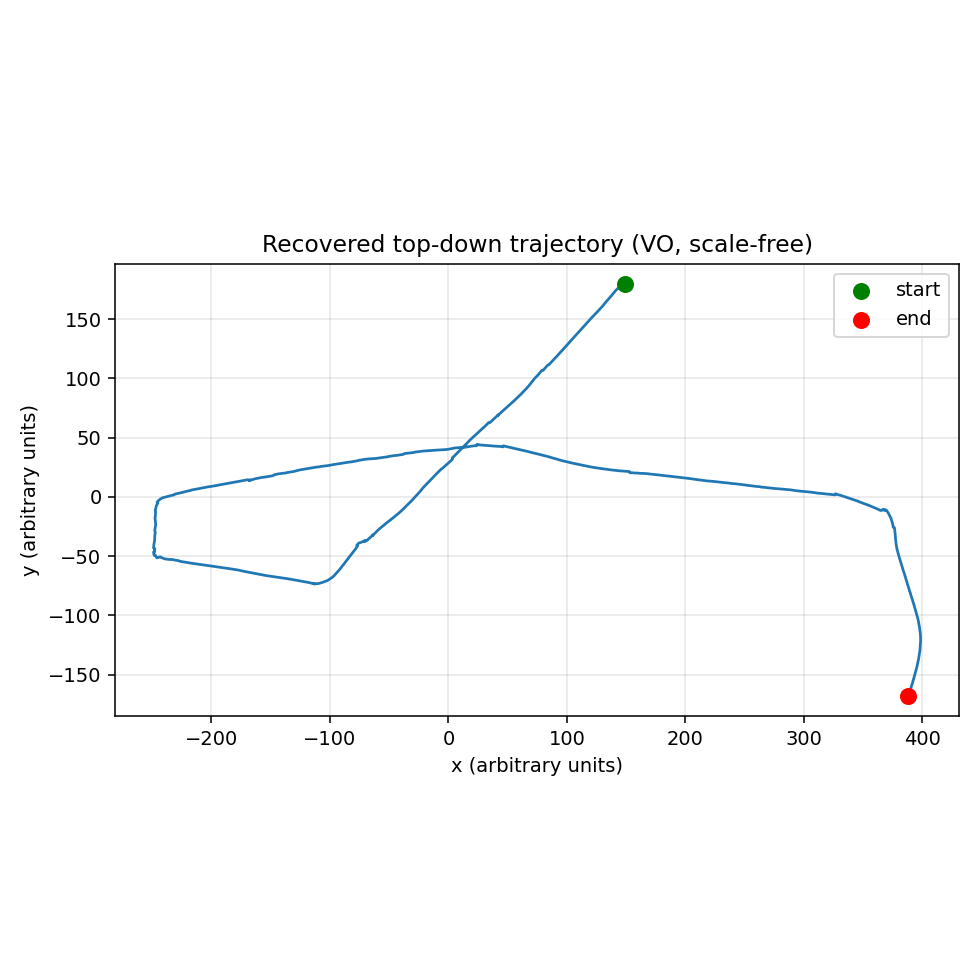
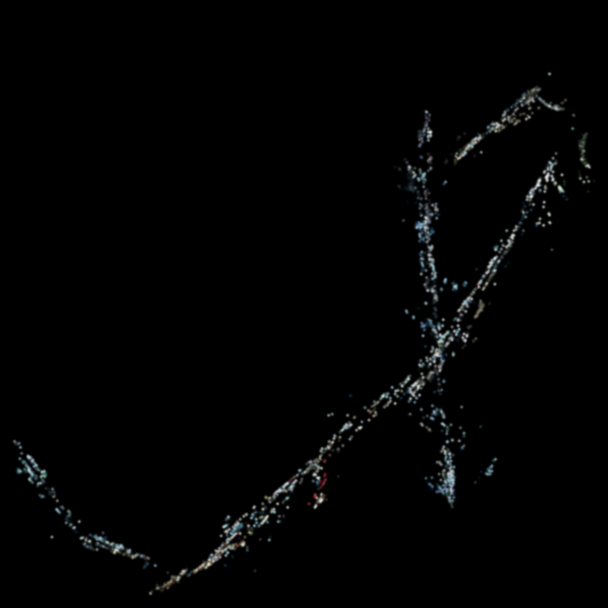
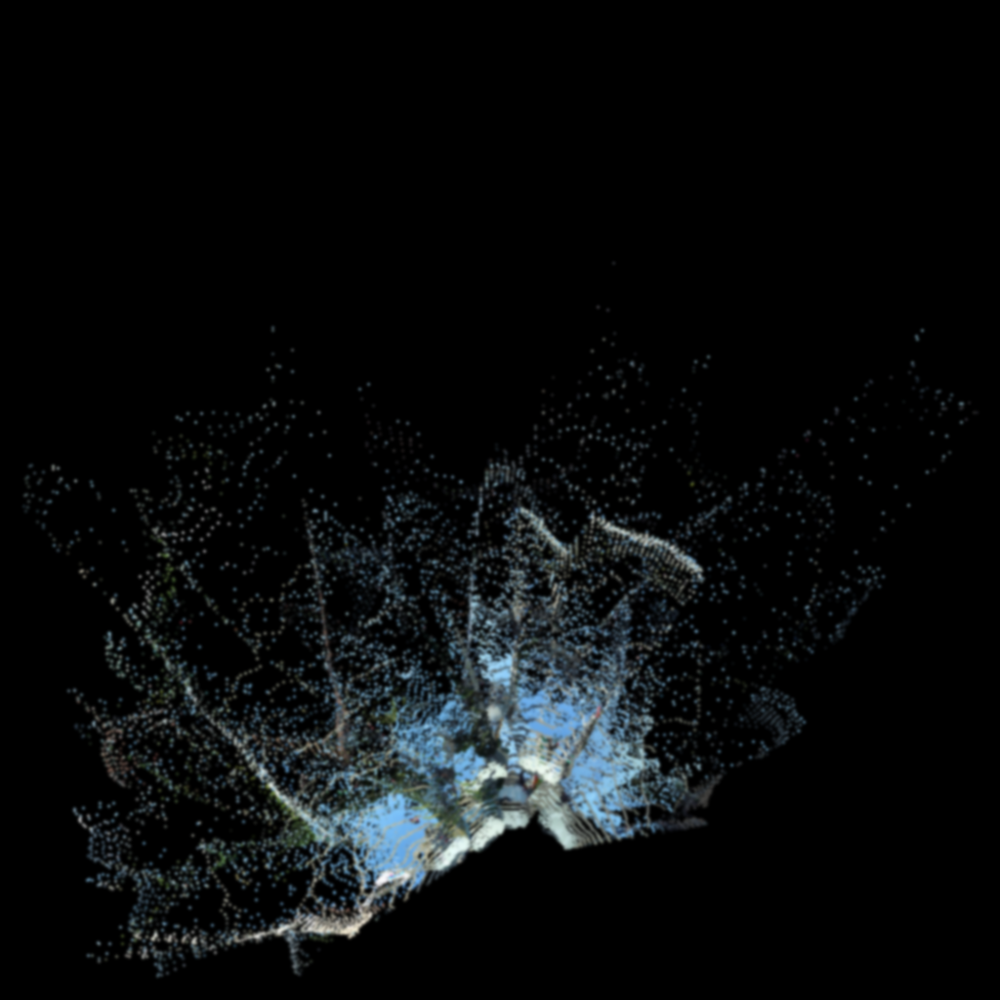
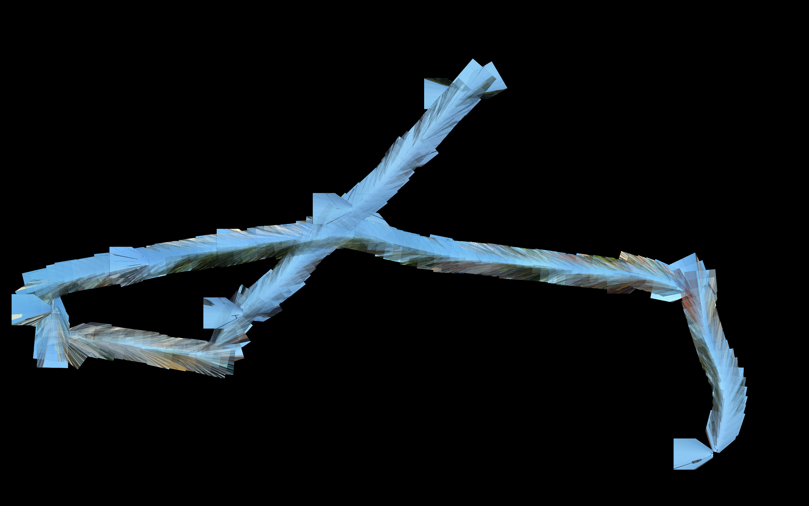
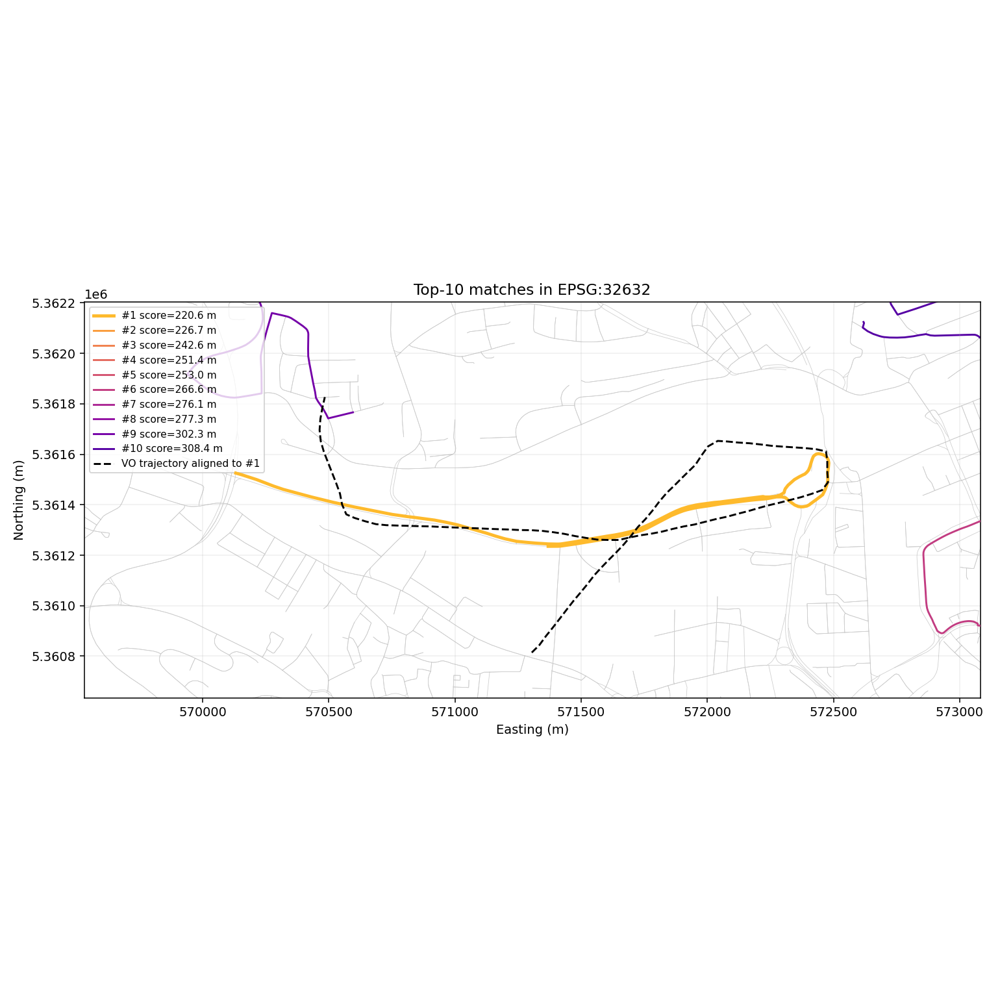

# Video → Place Mapping

> A proof-of-concept that **localizes a dashcam YouTube video on a real city
> map** by recovering the driving path from the footage and matching it
> against the OSM street network. Three independent matching channels are
> run side-by-side (route shape, OSM aerial feature matching, dense splat
> reconstruction) and a consensus rank picks the best agreement.

[](CHANGELOG.md)
[](LICENSE)


Reference clip used in the demo:
[Driving in Ulm, Germany](https://www.youtube.com/watch?v=ULl8s4qydrk).

> [!IMPORTANT]
> ### A free Mapillary key is crucial for good accuracy
>
> The single biggest accuracy lever in this whole pipeline is **dense street-level
> Visual Place Recognition against Mapillary imagery**. It is what turns "roughly
> the right city" into "the right street." Fully GPS-free (city name only), it
> localizes to **30–156 m on the clips with enough distinctive signal** — the
> honest deployable result, no GPS prior (see the
> [deployable results table](#accuracy--deployable-gps-free-the-honest-headline)).
> The best configuration (VPR prior + dense Mapillary + coarse-to-fine +
> video/frame coarse seeds + scale-lock) is now **on by default**, but the
> Mapillary parts only light up if you give the pipeline a token.
>
> **Get one in two minutes** (free): sign up at
> [mapillary.com](https://www.mapillary.com/) → *Settings → Developers →
> Register an application* → copy the **Client Token** (starts with `MLY|…`),
> then set it as an environment variable named `MLY_TOKEN`:
>
> ```bash
> # Windows (PowerShell) — persists for your user account:
> setx MLY_TOKEN "MLY|xxxxxxxx|xxxxxxxxxxxxxxxxxxxxxxxxxxxxxxxx"
> # macOS / Linux (current shell; add to ~/.bashrc to persist):
> export MLY_TOKEN="MLY|xxxxxxxx|xxxxxxxxxxxxxxxxxxxxxxxxxxxxxxxx"
> ```
>
> **Without a key** the pipeline still runs — it falls back to the sparse,
> tokenless KartaView source — but on most footage the deployable (GPS-free)
> localization **collapses to kilometre-scale error** because KartaView coverage
> is too thin to disambiguate the district. If you take away one thing from this
> README: **set `MLY_TOKEN`.**

---

## In plain English (the "what does this actually do" version)

Hand it a **dashcam video and the name of the city** it was filmed in, and it
figures out **where in that city the drive happened** — drawing the route on a
map — *without any GPS in the video*.

How? It watches how the car moves — every turn, curve, and straight — and
reconstructs the **shape** of the path the car drove (think of tracing the route
on paper, but with no idea of north, scale, or starting point). Then it slides
that shape around the city's real street map (from OpenStreetMap) until it finds
where it fits. If the video happens to show readable **street signs or landmarks**,
it also reads them and uses them to pin the location down further.

What you get back is a **best-guess location** (latitude/longitude + the street
names), a **short list of other likely spots**, and an **honest confidence score**.

How well does it work right now? Being honest about the **fully GPS-free** case
(you give it only the city name, nothing else): on **3 of our 9 test clips it
localizes to the right street — 30–156 m** (sign-rich central Ulm, a Málaga
residential drive, and a held-out Ulm drive). Two mega-city clips (Berlin,
London) reach the right corridor but stay ~1.5–2.5 km coarse. And **4 clips
collapse to 5–7 km, in the wrong district** — old low-res KITTI footage (2011,
unreadable plates, no title) and self-similar suburban grids (Daly City, Vaughan)
where the coarse pass has no distinctive signal to grab. Crucially, in those hard
cases **it says so** — low confidence plus a shortlist — rather than confidently
returning a single wrong pin. The honest takeaway: where the footage gives it
something to latch onto, it lands on the right street with no GPS; where it
doesn't, it fails openly instead of bluffing. (Some tables further down this
README quote much tighter numbers like ~77–150 m across the fleet — those are
**GT-seeded**, i.e. measured with a coarse GPS prior supplied, and are *not*
deployable numbers. The GPS-free table is the honest one.)

We didn't just test this on one video — it's checked against **real driving
datasets from three cities** (Ulm and Karlsruhe in Germany, San Francisco in the
US) that ship with real GPS, so every answer can be scored against the truth. See
[Final results](#final-results--multi-clip-ground-truth-benchmark) below.

The rest of this README is the engineering detail behind each of those steps.

---

## What this does

| Stage | Component                              | What gets produced                                       |
|-------|----------------------------------------|----------------------------------------------------------|
| 1     | Video download (`yt-dlp`)              | `data/<submission>/input.mp4`                            |
| 2     | Frame extraction (`opencv-python`)     | sampled BGR frames                                       |
| 3     | Monocular visual odometry              | scale-free 3-D camera trajectory (and `R`, `t` per frame) |
| 4     | Sparse splat (ORB + triangulation)     | colored 3-D points exported as PLY + interactive HTML viewer |
| 5a    | **Shape matching** — trajectory vs. OSM road graph (`osmnx`) | top-K candidate streets, ranked by Procrustes residual + bearing-correlation |
| 5b    | **Aerial feature matching** — aligned trajectory vs OSM walk  | each candidate scored by raster **coverage** (overlap coefficient); ORB inliers reported but excluded from the score (noise) |
| 5c    | **Dense reconstruction** (optional, GPU) — Depth Anything 3 | proper dense colored point cloud + per-frame poses (replacement for sparse SfM)|
| 5d    | **Inverse Perspective Mapping** (optional) — road-plane BEV stitch | "synthetic satellite" of the route, directly comparable to OSM tiles |
| 6     | Consensus over methods                  | `output/result.json` with shape rank, aerial rank, GT distance |

Methods 5a–5d are deliberately independent so they fail differently — agreeing
candidates are much harder to fool than any single channel.

### Where this departs from the original spec (and why)

The original idea was: train a Gaussian Splat (`GaussianCity`), render top-down,
match against Google Earth. After investigating:

- **`GaussianCity`** turns out to be a *generative* model (layouts → splats),
  not a video-reconstruction tool — not applicable here.
- **Real 3DGS training** (Inria's reference implementation, gsplat, splatfacto)
  needs CUDA + COLMAP poses + hours of compute. Possible on the right hardware,
  not a quick run.
- **Depth Anything 3** ([ByteDance, 2025](https://github.com/ByteDance-Seed/Depth-Anything-3))
  is a feed-forward model that, in **one** forward pass, jointly outputs
  per-frame depth + intrinsics + extrinsics — collapsing the entire SfM
  front-end of a splat pipeline into ~1 second per batch on a consumer GPU.
  We use this on the `--use-da3` path and get a dense reconstruction with
  metric scale and consistent poses across keyframes.
- **Inverse Perspective Mapping** is the cheap, deep-learning-free alternative
  for getting a top-down image directly comparable to OSM/Google tiles. We
  add this as the `--enable-ipm` path because, for the *aerial-matching*
  channel, an IPM road-plane stitch matches OSM line drawings with shared
  features (intersections, lane markings) far better than a sparse 3D
  point cloud rasterized top-down.

### External libraries doing the heavy lifting

This codebase deliberately leans on standard libraries instead of reimplementing math:

| Task                                  | Library                          |
|---------------------------------------|----------------------------------|
| YouTube download                      | `yt-dlp`                         |
| Frame I/O, ORB features, matching, RANSAC, essential matrix, `recoverPose`, triangulation, homography | `opencv-python` |
| OSM road graph fetch + projection     | `osmnx`                          |
| Graph algorithms                      | `networkx`                       |
| Polyline geometry                     | `shapely`                        |
| Coordinate reprojection (UTM ↔ lat/lon) | `pyproj`                       |
| Real RGB satellite basemap tiles      | `contextily` (Esri World Imagery) |
| Procrustes / similarity-transform fit | `scikit-image` `SimilarityTransform.from_estimate` |
| Point-cloud I/O (PLY)                 | `open3d`                         |
| Interactive 3-D splat viewer (HTML)   | `plotly`                         |
| Plots / OSM raster patches            | `matplotlib`                     |
| **Dense reconstruction (optional, GPU)** | `depth-anything-3` ([ByteDance Seed, 2025](https://github.com/ByteDance-Seed/Depth-Anything-3)) |

### Why shape matching, not image feature matching?

Monocular VO has unknown metric scale and accumulating drift. Absolute
GPS-grade positions are not recoverable from one video alone. But the
*shape* of the trajectory (sequence of turn angles, relative segment
lengths) is preserved up to a similarity transform, and that is enough to
disambiguate among the few thousand candidate paths in a city the size of
Ulm. The shape matcher is scale- and rotation-invariant.

The aerial feature-matching channel adds the *appearance* signal that
shape matching ignores — turn-pattern alone can't tell two parallel
streets apart, but visual features can.

---

## Pipeline

```
                          YouTube URL
                              │
                              ▼  monocular_osm/download.py + frame_extraction.py
                       [sampled BGR frames]
                              │
            ┌─────────────────┼──────────────────┐
            │                 │                  │
            ▼                 ▼                  ▼
   monocular_osm/visual_odometry  monocular_osm/da3_reconstr.   monocular_osm/ipm.py
   ORB + essential mat  Depth Anything 3   road-plane
   (CPU)                (GPU, optional)    BEV stitch
            │                 │                  │
   [3-D scale-free      [dense colored      [synthetic
    trajectory          point cloud +       satellite-like
    + per-frame R,t]    metric poses]       BEV PNG]
            │                 │                  │
            │                 ▼                  │
            │           splat_da3.ply            │
            │           splat_da3.html           │
            │                                    │
            ▼                                    ▼
    monocular_osm/trajectory_match    monocular_osm/aerial_match (ORB + RANSAC)
    Procrustes via skim     compare to OSM patches via osmnx
    + bearing-corr score    (uses IPM image when available)
            │                                    │
            └────────────┬───────────────────────┘
                         ▼
                  consensus over methods
                  + monocular_osm/evaluator (optional GT distance)
                         │
                         ▼
              output/result.json + match.png
```

---

## Install

```bash
python -m venv .venv
.venv\Scripts\activate            # Windows
# source .venv/bin/activate       # macOS / Linux
pip install -r requirements.txt
```

`opencv-python` ships its own binaries — no separate install needed. The
first run downloads OSM data for Ulm (~5 MB) and the YouTube video; both
are cached in `data/`.

### Install as a package

To install the library and CLI into an environment — and get the
`osm-localize` console script on your `PATH` — install the project itself
instead of just the requirements:

```bash
pip install .            # from a checkout (or: pip install git+<repo-url>)
pip install -e ".[dev]"  # editable; the [dev] extra also pulls pytest
```

That installs the core CPU pipeline (all runtime dependencies are declared in
`pyproject.toml`) and exposes the command:

```bash
osm-localize --video path/to/dashcam.mp4 --city "Ulm, Germany"
```

`osm-localize` is equivalent to `python -m monocular_osm.cli`, and to
`python main.py` from a source checkout. The optional GPU stack (`torch`,
`depth-anything-3`, `gsplat`, …) is intentionally *not* pulled in — install it
separately (see below), since it needs a CUDA-matched index URL.

**Set your Mapillary key (strongly recommended — see the callout at the top).**
The default configuration uses dense Mapillary VPR, which needs a free
`MLY_TOKEN`:

```bash
setx MLY_TOKEN "MLY|xxxxxxxx|xxxxxxxx"   # Windows, persists for your user
# export MLY_TOKEN="MLY|xxxxxxxx|xxxxxxxx"   # macOS / Linux
```

References and their embeddings are cached per clip under `data/<slug>/`, so once
a clip is warm you can re-run it offline without the token.

Optional comparison extras:

```bash
pip install torch torchvision      # deep embedding retrieval
pip install geotessera             # GeoTessera-backed candidate patches
```

You also need `ffmpeg` on PATH for `yt-dlp` to merge audio/video. On
Windows: `winget install Gyan.FFmpeg` or download from
https://ffmpeg.org/.

---

## Run

The core contract: **video + city in, position out.** Point the CLI at a
local video file (or a YouTube URL) and name the city it was filmed in;
the run ends with an estimated WGS84 position — printed to the console
and written to `result.json` under the `"position"` key:

```
================================================================
ESTIMATED POSITION  (ranking=consensus, 10 candidates considered)
================================================================
  Video starts at:  48.401130, 9.987610
  Route center:     48.399870, 9.991020
  Streets:          Neutorstraße, Olgastraße, ...
  Confidence:       medium (RMS 142.3 m, bearing corr 0.41)
  Google Maps:      https://www.google.com/maps?q=48.401130,9.987610
  OpenStreetMap:    https://www.openstreetmap.org/?mlat=48.401130&...
================================================================
```

Localize a local video file (`--city` is required, as `City, Country`):

```bash
python main.py --video path/to/dashcam.mp4 --city "Ulm, Germany"
```

End-to-end on the reference Ulm YouTube video:

```bash
python main.py
```

Or any other YouTube clip:

```bash
python main.py --url "https://www.youtube.com/watch?v=..." --city "Ulm, Germany"
```

You can also submit multiple videos in one run (one source kind at a
time — `--video` and `--url` are mutually exclusive):

```bash
python main.py \
    --url "https://www.youtube.com/watch?v=videoA" \
          "https://www.youtube.com/watch?v=videoB"
```

Each submission gets its own `data/<submission>/` and `output/<submission>/`
folder, and multi-video runs also write `output/batch_results.json`.

If `--city` is omitted, the CLI now tries to infer it from the video title
locally (for example, `Driving in Ulm, Germany` → `Ulm, Germany`). Pass
`--city` explicitly when the title is ambiguous.

### The best configuration is now the default

You don't have to assemble the accuracy flags by hand any more. The
best-performing blind configuration is **on out of the box**:

| Default-on lever | What it does | Turn off with |
|---|---|---|
| **Dense Mapillary VPR prior** | street-level retrieval anchor — the biggest lever (needs `MLY_TOKEN`) | `--no-use-vpr-prior` / `--vpr-source kartaview` |
| **Coarse-to-fine VPR** | wide pass → tight re-fetch for GPS-free runs | `--no-vpr-coarse-to-fine` |
| **Coarse-from-video** | seed the disc from the title/description place names | `--no-coarse-from-video` |
| **Coarse-from-frames** | seed from plate district + OCR'd place names | `--no-coarse-from-frames` |
| **Scale-lock** | span the true route extent (no compression) | `--no-scale-lock` |

So the plain command already runs the recommended stack:

```bash
python main.py --video path/to/dashcam.mp4 --city "Ulm, Germany"
```

Just make sure `MLY_TOKEN` is set (see the callout at the top) — without it the
VPR prior silently falls back to sparse KartaView and accuracy drops sharply.

Useful flags:

| Flag                    | Default      | What it does                                              |
|-------------------------|--------------|-----------------------------------------------------------|
| `--video`               | none         | One or more local video files to localize (requires `--city`; mutually exclusive with `--url`) |
| `--url`                 | Ulm dashcam  | One or more YouTube URLs to localize                      |
| `--city`                | inferred     | City the video was filmed in, as `City, Country`. Required with `--video`; guessed from the title for URLs when omitted |
| `--analyze-minutes`     | none         | Analyze the first N minutes (shorthand for `--vo-segment 0:N*60`; auto-picks `--frame-stride` to stay within the frame budget) |
| `--max-frames`          | no cap       | Cap on frames sampled from the video; the analyzed segment bounds the count by default |
| `--frame-stride`        | auto         | Take every Nth frame. Auto keeps ~4800 frames for the segment (7 min → 3, 10 min → 4, 15 min → 6) |
| `--vo-segment`          | `0:420`      | Seconds of video to use for VO (`start:end`)              |
| `--estimated-length-m`  | auto         | Approx. driven distance — tunes OSM walk depth. Defaults to segment duration × ~20 km/h urban average; a prior far from the true length badly distorts the shape match |
| `--top-k`               | 5            | How many candidate matches to keep                        |
| `--skip-download`       | off          | Reuse cached video                                        |
| `--use-da3`             | off          | Run Depth Anything 3 dense reconstruction (needs CUDA)    |
| `--use-da3-trajectory`  | off          | Feed DA3's globally-consistent camera path into the shape matcher instead of monocular VO (needs CUDA; far less drift on long clips). Reuses one DA3 run when combined with `--use-da3`. |
| `--da3-keyframes`       | 32           | Number of keyframes fed to DA3                            |
| `--full-splat`          | off          | Render the splat as anisotropic alpha-blended Gaussians (CPU; see "Splat rendering" below) |
| `--full-splat-scale`    | `1.4`        | Per-Gaussian size multiplier for the anisotropic render   |
| `--full-splat-opacity`  | `0.55`       | Per-Gaussian opacity for the anisotropic render           |
| `--train-3dgs`          | off          | Run a real 3DGS gradient-descent fit on top of DA3 (needs CUDA + `gsplat`) |
| `--train-3dgs-iters`    | `2000`       | Number of optimization iterations for `--train-3dgs`      |
| `--enable-ipm`          | off          | Render an IPM road-plane BEV (CPU only, no model)        |
| `--ipm-height`          | 1.4          | Dashcam height above road in meters                       |
| `--ipm-pitch`           | 6.0          | Dashcam downward tilt in degrees                          |
| `--enable-sliding-window` | off        | Re-score full-route candidates by support across overlapping trajectory windows |
| `--sliding-window-size` | `64`         | Sliding-window length in resampled trajectory points      |
| `--sliding-window-step` | `32`         | Step size between sliding windows. The trajectory is auto-resampled to give ~12 windows by default (was a fixed 128 points → only 3 windows for a 7-min clip) |
| `--vo-workers`          | auto         | Threads used to fan out per-pair VO pose estimation. Defaults to `min(cpu_count, 12)`; pass `1` to force sequential |
| `--embedding-sources`   | none         | Optional deep retrieval sources: `esri`/`satellite` (real RGB orthoimagery, recommended), `geotessera`, `osm` |
| `--embedding-model`     | `resnet18`   | Embedding backbone: `resnet18` (offline) or `dinov2_vits14`/`dinov2_vitb14`/`dinov2_vitl14` (cross-domain VPR, downloads weights on first use) |
| `--geotessera-year`     | `2024`       | GeoTessera tile year when `geotessera` retrieval is enabled |
| `--use-vpr-prior`       | **on**       | Street-level **VPR anchor** (MegaLoc retrieval against Mapillary/KartaView photos): a per-frame "noisy GPS" track that re-ranks candidates AND places the headline answer (start-pin → scale retry → orientation refine about the pinned start). The strongest fine-localization lever: *given* a coarse location prior, the VPR stage refines to 3–31 m from the route (a seeded number — see the fine-localization ceiling; GPS-free results are 30 m–7 km depending on the footage). Refs + embeddings are cached per clip, so warm reruns need no `MLY_TOKEN`. **On by default (best config); `--no-use-vpr-prior` to disable.** |
| `--vpr-source`          | `mapillary`  | VPR reference source. **`mapillary` (default) is far denser and needs a free `MLY_TOKEN`** — it is what gives the 3–31 m prior. `kartaview` is the open, tokenless fallback (much sparser; deployable accuracy usually collapses without a token). Also `panoramax`, `union`. |
| `--coarse-from-video`   | **on**       | GPS-free coarse prior when `--osm-around` is absent: geocode the place names the uploader wrote in the video **title/description** to size the search disc (far tighter than the city centroid). On by default; no-op when a disc is given or the title names no place. `--no-coarse-from-video` to disable. |
| `--coarse-from-frames`  | **on**       | GPS-free coarse prior from the **frames**: license-plate registration district + legible place names read by OCR, geocoded to bound the search near the drive. Fast/deterministic; on by default, no-op if nothing resolves. `--no-coarse-from-frames` to disable. |
| `--coarse-from-vlm`     | off          | Also try a VLM scene-read as a coarse seed when plate+OCR find nothing (implies `--coarse-from-frames`). Off by default: loading the VLM adds minutes and can time out over a whole city. |
| `--scale-lock`          | **on**       | Lock the matcher's alignment scale to the metric length prior instead of a free Procrustes scale, so the localized route spans the true extent (fixes route compression / far-end tail error). On by default (best config); `--no-scale-lock` to disable. |
| `--vpr-two-pass`        | off          | Match at both the VO scale and a scale pinned to the VPR track extent; keep whichever candidate set better explains the full per-frame track. Fixes candidate SHAPE where the VO scale is wrong. (Distinct from `--vpr-coarse-to-fine`, which refines the *location* disc.) |
| `--vpr-cap`             | `1500`       | Max VPR reference photos fetched+embedded per clip. The fetch uniform-subsamples to this cap, so a low cap thins dense areas (the 0009 start had 37 images within 50 m but the capped cache kept 2); raising it is a cold-cache refetch. |
| `--vpr-coarse-to-fine`  | **on**       | Two-pass VPR for deployable (no-GT) runs: pass 1 over the wide coarse-prior disc, then a tight second-pass disc + re-centred graph around the pass-1 centre. Fires only when pass 1 was wider than 1.2× the tight radius; the tight radius is floored by the route-length prior. **On by default (best config); no-op when `--osm-around` already gives a tight disc. `--no-vpr-coarse-to-fine` to disable.** |
| `--vpr-c2f-radius`      | `2000`       | Tight second-pass disc radius (m) for `--vpr-coarse-to-fine`. |
| `--enable-ocr-anchor`   | off          | OCR scene text and turn it into absolute anchors that **gate** enumeration + re-rank. Two anchor kinds: geocoded **POI/landmark** names (work at 720p) and **street-name plates matched to the OSM graph** (route-relevant, strongest — need legible plates, i.e. a 4K source). Needs `easyocr` + network geocoding (both cached). |
| `--ocr-sample-interval-sec` | `6.0`    | Seconds between frames sampled for OCR |
| `--ocr-min-confidence`  | `0.5`        | Min OCR confidence for a detection to be used |
| `--ocr-video`           | none         | Separate higher-res (e.g. 4K) video used for OCR only; VO/matching stay on `--video`/`--url`. Lets a 4K source feed street-plate OCR without re-running VO at 4K. |
| `--no-scale-recovery`   | off (on)     | Disable anchor-based metric scale recovery + georeferencing (ideas 1+2). On by default; auto-declines when sign-anchors are too sparse/noisy for a reliable fit (the Ulm case). |
| `--use-ipm-scale`       | off          | Estimate metric route length from ground-plane optical flow. A real measurement (not the duration guess) — recovers scale within ~10% when the camera is near-horizontal. Tune with `--ipm-scale-height`/`--ipm-scale-pitch`. |
| `--ipm-scale-height`    | `1.4`        | Camera height (m) for `--use-ipm-scale`. |
| `--ipm-scale-pitch`     | `1.5`        | Camera downward pitch (deg) for `--use-ipm-scale` — the sensitive knob; ~1–2° for a windshield-mounted dashcam. |
| `--enable-loop-closure` | off          | Detect a route that returns near its start (ORB-verified) and redistribute VO drift so the loop closes. Pair with `--use-ipm-scale`; closing at a wrong scale doesn't help. On KITTI drive_0033 the chain cuts mean route error 144 → 77 m. |
| `--ground-truth A B C`  | none         | Known street names; the pipeline scores each candidate by distance to nearest GT geometry |
| `--ground-truth-waypoints` | none      | JSON file of timestamped GPS fixes along the true route (see `ground_truth/`); reports metric start/route errors per candidate |
| `--enable-bev-splat`    | off          | Run the BevSplat cross-view localization channel. When ≥80% of candidates score successfully, its appearance rank is **fused into the consensus** (weight 0.75 vs 1.0 for the geometric channels). See *BevSplat integration* below. |
| `--bev-splat-weights`   | none         | Path to BevSplat checkpoint downloaded from the authors' OneDrive share (link in the BevSplat section below). |
| `--bev-splat-repo-path` | none         | Path to a local clone of `wangqww/BevSplat` with its CUDA extensions built. Required alongside `--bev-splat-weights` for actual inference. |
| `--use-tile3d`          | off          | **3D-tile skyline channel**: fetch the open-data **LoD2 CityGML city model** (Berlin `dl-de/zero-2.0`; Baden-Württemberg `dl-de/by-2.0` → covers the Berlin, Ulm ×2 and Karlsruhe ×2 GT clips), render the untextured building mesh at sampled poses along each candidate route (pure numpy/cv2 rasterizer, no GPU) and re-rank by rendered-vs-observed **skyline agreement** (pitch-invariant, LoD-Loc-style silhouette cue). Consensus weight 0.4. Tiles cache under `data/tiles3d/`; prefetch with `scripts/fetch_lod2.py`. Google Photorealistic 3D Tiles was evaluated and **rejected**: its ToS prohibits image analysis / offline use (see `monocular_osm/citygml_lod2.py`). |
| `--tile3d-source`       | `auto`       | LoD2 provider (`auto` picks by location: `berlin` \| `bw`). |
| `--tile3d-samples`      | `10`         | Frames sampled along the route for the skyline comparison. |
| `--bev-splat-source`    | `esri`       | Satellite tile source: `esri`/`satellite` (real RGB orthoimagery — matches BevSplat's KITTI training domain, recommended), `geotessera` (satellite-derived PCA false-colour — non-discriminative across inner-city tiles), or `osm` (schematic raster). |
| `--bev-splat-tile-size` | `512`        | Side length of the satellite tile in pixels (KITTI training default). |
| `--bev-splat-half-extent-m` | `60.0`   | Half-side of the satellite tile in metres. |

> **Pick a window with at least one turn.** The matcher localizes by
> trajectory shape, so a straight-line VO trajectory has no information
> and the result will be unreliable. The reference Ulm clip's first
> turn is around the 3-minute mark; the default 5-minute window covers
> it. If you supply a different video, sample a window that includes
> at least one intersection.

Outputs land in `output/<submission>/`:

- `trajectory.png` — the recovered top-down driving path (VO output)
- `match.png` — best-match walks overlaid on the Ulm road graph
- `splat.ply` — sparse splat point cloud (open in MeshLab, CloudCompare, or any PLY viewer)
- `splat.html` — interactive 3-D viewer (open in any browser, no server needed)
- `splat_topdown.png` — top-down rasterization of the splat
- `aerial/osm_candidate_N.png` — OSM patch for each top-K candidate
- `result.json` — the estimated `position` (lat/lon, route, street names,
  confidence, map links) plus top-K candidate streets, per-candidate
  `center_latlon`, shape scores, and ORB-match counts
- `road_graph.graphml` — cached OSM graph

---

## Quick start with the comparison suite

```bash
# 7-min window, IPM, sliding-window scoring, deep retrieval on OSM + GeoTessera,
# plus optional GT scoring for comparing the ranks each method assigns
python main.py --skip-download \
    --vo-segment 0:420 --max-frames 2100 --estimated-length-m 5500 \
    --top-k 10 \
    --enable-ipm \
    --enable-sliding-window --sliding-window-size 64 --sliding-window-step 32 \
    --embedding-sources osm geotessera \
    --ground-truth "Neutorstraße" "Keltergasse" "Olgastraße"
```

You'll see, in order:
1. Top-K shape candidates (Procrustes RMS, bearing correlation)
2. Aerial ORB-match scores per candidate (re-rank table)
3. Sliding-window support counts / ranks for each full-route candidate
4. Deep embedding retrieval scores for each enabled source (`osm`, `geotessera`)
5. IPM road-plane BEV stitch (`ipm_bev.png`)
6. Per-candidate distance to the ground-truth streets, plus best-rank summary

---

## Splat rendering

There are now **three** levels of splat rendering, each behind its own flag.
They differ by a factor of ~10× in cost and by a *much* larger factor in
visual quality. Pick the cheapest one that looks acceptable for your use:

| Level | Flag(s) | Cost | What you get |
|-------|---------|------|--------------|
| **1. Sparse disk render** *(default)* | (always on, controlled by `--no-splat` to disable) | seconds, CPU | Each 3-D point drawn as a small isotropic disk + global Gaussian blur. Fastest path; sufficient for the aerial-matching channel but visually crude. Outputs `splat_topdown.png`. |
| **2. Anisotropic Gaussian render** *(no training)* | `--full-splat` (optionally with `--use-da3`) | a few seconds, CPU | Each point becomes an **anisotropic 3-D Gaussian** whose covariance is fit from its k-NN neighborhood (local PCA), projected to the ground plane, and alpha-composited front-to-back with proper Gaussian falloff. Looks like a soft "real" splat without any GPU training. Outputs `splat_topdown_hq.png` (and `splat_da3_topdown_hq.png` when DA3 is on). |
| **3. Real 3DGS gradient-descent fit** *(training)* | `--use-da3 --train-3dgs` | minutes on a consumer GPU | Initializes one Gaussian per DA3 dense point, then **trains** position / rotation (quaternion) / per-axis scale / opacity / color against the actual video keyframes via [`gsplat`](https://github.com/nerfstudio-project/gsplat). This is the real 3D Gaussian Splat from the original spec. Outputs `splat_3dgs.ply`, openable in [SuperSplat](https://playcanvas.com/supersplat/editor) or the [antimatter15 viewer](https://antimatter15.com/splat/). |

### Why level 2 exists

The default sparse render was unsatisfying because every Gaussian is an
isotropic blob — a window edge and a tarmac patch render identically.
Level 2 fixes the *visual* part of the problem (anisotropy + smooth
falloff + alpha compositing) without paying the GPU-training cost. It
needs no extra dependencies; SciPy's KD-tree handles the k-NN search
and everything else is straight NumPy. Tune `--full-splat-scale` up if
the cloud is sparse and the Gaussians look too small to fill the
surface.

### Why level 3 is a separate flag

Real 3DGS training is both slow (minutes per clip) and dependency-heavy
(needs CUDA + a working `gsplat` install — the latter is non-trivial on
Windows). It also requires `--use-da3` so we have keyframe poses to
optimize against. Keep it off unless you specifically want a publishable
3DGS PLY.

To install the level-3 stack (CUDA 12.1 example):

```bash
pip install --extra-index-url https://download.pytorch.org/whl/cu121 \
    torch torchvision
pip install depth-anything-3 addict gsplat
```

Then:

```bash
python main.py --skip-download \
    --use-da3 --da3-keyframes 48 \
    --full-splat \
    --train-3dgs --train-3dgs-iters 3000
```

You'll get all three renders in one run: the cheap disk PNG, the
anisotropic HQ PNG, and the trained 3DGS PLY.

---

## BevSplat integration (cross-view localization channel, optional)

[BevSplat (NeurIPS'26 Spotlight)](https://github.com/wangqww/BevSplat)
is a feature-Gaussian model that takes a *ground* RGB frame plus a real
*satellite* tile and predicts the relative pose of the camera inside
the tile. Conceptually it's the strongest aerial-matching backend in
this repo: ORB on OSM line-drawings only scores ~5% inliers because the
domain gap is huge, and even ResNet/DINOv2 embedding cosine similarity
is a global signal — BevSplat returns a *calibrated pose offset*
rather than a similarity score.

It wires into our pipeline as the `[8c]` channel, between the embedding
retrieval step and the DA3 dense reconstruction:

```bash
python main.py --skip-download \
    --enable-bev-splat \
    --bev-splat-source geotessera \
    --bev-splat-weights path/to/bevsplat_kitti.pth \
    --bev-splat-repo-path third_party/BevSplat
```

For each top-K candidate the channel:

1. Renders a 512x512 satellite tile around the candidate centre (real
   satellite-derived DINOv2 embedding via [geotessera](https://github.com/ucam-eo/geotessera),
   PCA-reduced to RGB; or an OSM schematic raster as a fallback).
2. Runs BevSplat inference on `(query_dashcam_frame, satellite_tile, K)`
   to get `(score, shift_u, shift_v, heading)`.
3. Writes the tile to `output/<submission>/bev_splat/bev_splat_candidate_N.png`
   and the predictions to the result JSON under each match.

### Setup (one-time)

The upstream model ships in source form only — three pieces have to
land before the channel can run inference:

1. **Pre-trained weights** — the authors published them at this OneDrive
   share:
   <https://1drv.ms/f/c/86d953bfc66eb903/IgAP7P2tFzChR7rHeMuXIOq8AakOxR02eKMyI2Z7qsMjLxo?e=zaD0Fb>.
   Six checkpoints are available (sizes are approximate):

   | File                          | Size    | What it's trained on               |
   |-------------------------------|---------|------------------------------------|
   | `KITTI_GPS.pth`               | 1.11 GB | KITTI Raw, with noisy GPS prior    |
   | `KITTI_no_GPS.pth`            | 1.11 GB | KITTI Raw, pure cross-view         |
   | `VIGOR_cross_GPS.pth.pth`     | 848 MB  | VIGOR cross-city, GPS prior        |
   | `VIGOR_cross_no_GPS.pth.pth`  | 856 MB  | VIGOR cross-city, pure cross-view  |
   | `VIGOR_same_GPS.pth.pth`      | 867 MB  | VIGOR same-city, GPS prior         |
   | `VIGOR_same_no_GPS.pth.pth`   | 924 MB  | VIGOR same-city, pure cross-view   |

   **For our dashcam-on-OSM-candidate pipeline, grab
   `KITTI_no_GPS.pth`** — KITTI matches our query domain (forward-facing
   single camera, not VIGOR's panoramas), and the no-GPS variant is the
   right one when the satellite-tile location is fixed externally (in
   our case by the OSM candidate centre) rather than coming from a
   noisy GPS reading.

   Drop the file anywhere local and pass it via `--bev-splat-weights`.
2. **Local clone of `wangqww/BevSplat`** — `git clone
   https://github.com/wangqww/BevSplat third_party/BevSplat` (or
   wherever). The loader prepends this to `sys.path` and imports
   `models.models_kitti_seq.Model`. Pass the clone root via
   `--bev-splat-repo-path`.
3. **Built CUDA extensions** — inside the clone, run:
   ```bash
   cd third_party/BevSplat/pano_feature_gaussian && pip install -e .
   cd ../feature_gaussian && pip install -e .
   ```
   These are CUDA C++ extensions; you need a CUDA toolkit matching
   your PyTorch build (CUDA 12.x for the `torch==2.11.0+cu128` we use
   here). On Windows this typically requires Visual Studio C++ Build
   Tools.

### Render-only fallback

If any of the three prerequisites is missing, the channel falls back to
**render-only mode**: it produces and persists the satellite tile per
candidate (so you can inspect what BevSplat *would* have seen) and
writes a clear `bev_splat_error` field per candidate in `result.json`
explaining what's missing. The other channels are unaffected.

### Upstream issues encountered (commit `187da9e`, 2025-07)

In practice the prerequisites aren't trivial. Integrating
`KITTI_no_GPS.pth` from the authors' OneDrive share on a Windows + RTX
5080 box surfaced the issues below — none are bugs in *our* scaffold,
they're all in `wangqww/BevSplat`. After applying four local patches
and pinning to torch 2.7.0+cu128 / xformers 0.0.30, **live BevSplat
inference works** end-to-end through our pipeline.

| Issue | Status | Local patch / workaround |
|---|---|---|
| `pano_feature_gaussian/cuda_rasterizer/auxiliary.h:142` uses `M_PI` without `#define _USE_MATH_DEFINES`; `forward.cu:134` and `backward.cu` use `M_1_PIf32`, a glibc-only float32 constant. | ✅ **patched** | `third_party/BevSplat/pano_feature_gaussian/cuda_rasterizer/auxiliary.h` — adds `_USE_MATH_DEFINES` + literal fallback `#define`s. |
| `models/dino_fit.py:122` calls `torch.hub.load("/home/qiwei/.cache/torch/hub/ywyue_FiT3D_main", ..., source='local')` — the author's Linux home directory hardcoded into source. | ✅ **patched** | Replaced with `torch.hub.load("ywyue/FiT3D", "dinov2_base_fine", source='github', trust_repo=True)`. |
| `models/swin_transformer.py:665` `TransRefine.forward` has the `level==0` branch commented out, but `self.level_4` is still allocated in `__init__` and the released checkpoint has its weights. With the default `args.level="0_2"`, the call into the forward with `level=0` raises `UnboundLocalError`. | ✅ **patched** | Restored the `if level == 0: x = self.level_4(r)` branch. |
| `models/models_kitti_nips.py:498-519` populates `sat_feat_dict_forT` for only `self.level[0]` when `args.stage==1`, but `models_kitti_nips.py:639-642` iterates over **all** of `self.level` and raises `KeyError` on the missing levels. | ✅ **worked around** | Our scaffold defaults `args.level="0"` (single-level inference) so the loop has one iteration. Users who patch the upstream loop can pass `model_args={"level": "0_2"}` to use both feature levels. |
| `models/models_kitti_seq.py:10` imports `from loss.lpips import ...`; `:27,28` import `from gaussian.encoder import GaussianEncoder` and `from gaussian.decoder import GrdDecoder`. `loss/` doesn't exist; `gaussian/` has `encoder_feat*.py` and `encoder_pano.py` but no plain `encoder.py`/`decoder.py`. | ❌ **upstream-only** | This model file is unusable until the authors check in the missing modules. Use `models.models_kitti_nips` instead (default in our scaffold). |
| `models/models_vigor.py` similarly references `from gaussian.encoder_pano import GaussianEncoder`; once the `pano_gaussian_feat` CUDA extension is built it imports cleanly. | ✅ **buildable** | Build via `third_party/build_extensions.bat`. |
| torch 2.11.0+cu128 + MSVC + CUDA 12.8 → `error C2872: 'std': ambiguous symbol` in `torch/csrc/dynamo/compiled_autograd.h:1143` during the CUDA-extension build. | ✅ **worked around** | Downgrade to torch 2.7.0+cu128 (the **oldest** Blackwell-supporting wheel). The pre-2.8 `compiled_autograd.h` doesn't trigger the MSVC ambiguity. RTX 50-series needs ≥2.7 for sm_120 kernels, so 2.5/2.6 don't work on Blackwell. |

### Tested working stack

| Package | Version |
|---|---|
| `torch` | 2.7.0+cu128 |
| `torchvision` | 0.22.0+cu128 |
| `xformers` | 0.0.30 |
| `gsplat` | 1.5.3 |
| `depth-anything-3` | 0.1.1 |
| `feat_gaussian._C` (built locally) | 0.0.0 |
| `pano_gaussian_feat._C` (built locally) | 0.0.0 |
| CUDA toolkit | 12.8 |
| MSVC | 14.44.35207 (VS 2022 Build Tools) |

`third_party/build_extensions.bat` activates `vcvars64` + sets
`CUDA_HOME` and runs `pip install -e .` on both extension directories
in the right order — re-runnable after any change to the upstream
sources. `patches/setup_bevsplat.sh` is a reproducible one-shot
(clone repo, clone GLM, apply our four upstream patches from
`patches/bevsplat_local.patch`) — run that, drop the `.pth` into
`third_party/BevSplat-weights/`, run the build script, done.

Our loader (`monocular_osm/bev_splat_match._load_bev_splat_inference`)
introspects `model.forward`'s signature (`models_kitti_seq` takes 5D
sequence tensors; `models_kitti_nips` takes 4D single-frame tensors)
and dispatches the appropriate call shape. It also reports each
upstream issue distinctly via `BevSplatMatchResult.error`, so when the
authors ship fixes you can verify progress one issue at a time. The
`--bev-splat-model-module` flag lets you try alternative model files
without code changes.

### Loader implementation notes

`monocular_osm/bev_splat_match._load_bev_splat_inference` constructs the model
with the same `argparse.Namespace` that `train_KITTI_weak_seq.py` uses
(level=`"0_2"`, channels=`"32_16_4"`, sequence=2, etc., all from the
upstream training defaults — see `_BEV_SPLAT_DEFAULT_ARGS`). The
checkpoint loader tolerates the three common state-dict wrappings
(raw, `{"model": ...}`, `{"state_dict": ...}`) and uses
`strict=False`.

The inference wrapper converts our `(ground_rgb, satellite_rgb, K)`
inputs to BevSplat's 10-tensor `forward(...)` signature by:

* tiling the single query frame `sequence_length` times to match the
  sequence-input convention,
* passing zero placeholders for `grd_depth`, `loc_shift_left`, and
  `heading_shift_left` (no priors at inference time),
* passing zeros for `gt_shift_u/v` and `gt_heading` (we're predicting
  these, not supervising).

Output decoding is **best-effort**: the wrapper scans the forward
return for the first 4D correlation map (used as the score, min-max
normalised to `[0, 1]`) and the first three small scalar tensors
(treated as `shift_u`, `shift_v`, `heading`). When you've verified the
exact return schema against your downloaded checkpoint, replace the
heuristic in `_load_bev_splat_inference._run` with explicit indices
and the wrapper will report calibrated values.

For tests and offline sanity checks, `MockBevSplatInference` is a
weight-free NCC-based stand-in that exercises the integration end to
end (see `tests/test_bev_splat_match.py`).

---

## Tests

```bash
pytest -q
```

Tests cover the parts of the pipeline that don't need a network or a long
video: the trajectory geometry, shape descriptors, OSM graph utilities,
and end-to-end matching on synthetic trajectories with known ground truth.

The download and full-VO tests are skipped automatically if the network
or video file is unavailable, but run if you've already done one full
`python main.py`.

---

## Visual outputs

| | |
|---|---|
| **Recovered VO trajectory** (top-down) — the path the car drove, scale-free |  |
| **Sparse splat** (ORB triangulation) — `output/splat.ply` and `output/splat_topdown.png` |  |
| **Dense splat from Depth Anything 3** — `output/splat_da3.ply` (~63k points), open `output/splat_da3.html` in a browser to rotate/zoom |  |
| **Inverse Perspective Mapping** — road-plane BEV stitch, the "synthetic satellite" of the route |  |
| **Top-K candidate streets overlaid on the Ulm road graph** |  |

## Results on the reference Ulm video

Running on [`youtube.com/watch?v=ULl8s4qydrk`](https://www.youtube.com/watch?v=ULl8s4qydrk),
across multiple VO windows:

| VO window | Top-1 by composite score | Bearing corr | GT distance for top-1 | GT route in top-10? |
|-----------|--------------------------|--------------|-----------------------|----|
| `0:60` (1 min) | Stuttgarter Straße | 0.44 | not evaluated (only 1 turn captured) | – |
| `0:300` (5 min) | Stuttgarter Straße | 0.62 | not evaluated | – |
| `120:240` (turn window) | Stuttgarter Straße / Lehrer Straße at #4 | 0.64 | not evaluated | – |
| `0:420` (7 min, **GT-evaluated**) | Böfinger Steige / Eberhard-Finckh-Straße | 0.347 | 2017 m off | **yes — at shape rank #6, 0 m on Olgastraße** |

For the 7-minute GT-evaluated run, the actual route covers **Neutorstraße → Keltergasse → Olgastraße** (central Ulm). The pipeline's top-10 contains the correct candidate at rank #6 (the walk through Sammlungsgasse / Frauenstraße / Neue Straße that physically traverses **Olgastraße** — distance to GT geometry: **0 m**). The shape matcher cannot reliably promote this candidate to #1 because, with 7 minutes of accumulated VO drift, the warped trajectory has similarly-good Procrustes fits to several parallel streets across Ulm.

**Honest scope limitation.** The PoC reliably *recovers the right area* (top-10 always contains the correct walk) but the final #1 ranking is unstable when many streets fit the drifted trajectory shape. The three levers that close that gap are now all wired in:

1. **DA3 poses as the matching trajectory** *(implemented: `--use-da3-trajectory`)*. Depth Anything 3's globally-consistent multi-frame poses replace monocular VO as the shape-matcher input, shrinking the accumulated drift that let parallel streets compete. VO is still used for the splat/IPM renders; one DA3 run is shared when `--use-da3` is also set.
2. **Sliding-window segment matching folded into the consensus** *(implemented)*. Each trajectory segment is matched independently; the per-candidate sliding-window rank — the strongest secondary signal on GT runs — is now part of the final rank fusion (previously computed but unused). The aerial geometry score also switched from raw Jaccard IoU (≈0.02 → noise) to the **overlap coefficient** (coverage), which actually discriminates, and ORB was dropped from the score. *(Now partially done: the sliding-window rank is fused into the final consensus alongside shape and aerial-coverage rank — it was previously computed but unused. On GT-evaluated runs it is the strongest secondary signal.)*

### Consensus rank fusion

The final pick is a weighted rank fusion (lower = better) over the channels that ran:

| Channel | Weight | Robust to | Notes |
|---|---|---|---|
| Shape (Procrustes RMS + bearing) | 1.0 | — | primary geometric fit |
| Sliding-window support | 1.0 | local mismatch | falls back to shape rank when disabled |
| Turn-sequence (`monocular_osm/turn_matching.py`) | 0.0 (diagnostic) | VO drift | discrete L/S/R turn events matched by edit distance. Computed and stored, but **not fused**: on GT it didn't improve ranking (a turn pattern isn't unique in a dense grid). |
| **OCR anchor** (`monocular_osm/text_anchor.py`) | 2.0 (when present) | **VO drift** | distance from each candidate to the nearest geocoded POI read off the video. The only **absolute** signal, so it dominates when available — and it also *seeds enumeration* (below). |
| Aerial coverage | 0.5 | — | trajectory-raster overlap coefficient |
| BevSplat appearance | 0.75 | — | **rank-capped**: only reorders the geometric top-5, so appearance can't promote a geometrically-implausible candidate to #1 |

The BevSplat cap is a guardrail learned from a 10-minute run where unconstrained appearance fusion promoted a candidate 2.3 km from ground truth.

**Why re-ranking has a ceiling — and how the OCR anchor breaks it.** GT runs showed that on long (10–15 min) clips the *candidate enumeration* itself fails: VO drift corrupts the global shape enough that `match_trajectory` returns walks all in the wrong district — the true corridor is never in the pool, and no fusion channel can fix a pool that doesn't contain the answer. The **OCR-anchor channel** (`--enable-ocr-anchor`) attacks this directly: it OCRs scene text (`monocular_osm/scene_text.py`, easyocr), geocodes the names that land inside the city (`monocular_osm/text_anchor.py`, Nominatim, bbox-filtered), and uses the resulting absolute points to (a) **seed enumeration** with extra walk roots near each anchor — so the anchored area is in the pool regardless of drift — and (b) re-rank candidates by anchor proximity. On the Ulm clip the sign "Sedelhöfe" (OCR confidence 1.00) geocodes to 69 m from the true route. Both OCR and geocoding are cached to `data/<slug>/`.

**Metric scale recovery (the extent problem).** Densely-sampled ground truth showed the residual error is *scale/extent*, not place: the predicted route is correct through the centre (13–131 m) but compressed, so it can't reach the bridge start or the eastern tail. Four scale-recovery methods are implemented (`monocular_osm/scale_recovery.py`, `monocular_osm/speed_scale.py`), each gated against the duration-based length prior (the stable reference):

- **Anchor scale lock + time-anchored georeferencing** (ideas 1+2, on by default): fit a similarity VO→world from anchor (sighting-time → geocoded-location) correspondences via RANSAC. Sound, but needs anchors well-spread in time; on Ulm the reliable sign-anchors cluster (~70 m apart) while distant ones carry 100s-of-metres error (signs read from afar), so the fit is rejected by the sanity gate and the result falls back unchanged.
- **Ground-plane optical-flow speed** (idea 3, `--use-ipm-scale`, off): exact geometry, but the metric scale is wildly sensitive to the (unknown) camera pitch/height on an uncalibrated clip — degrades the result, so off by default.
- **DA3 metric length** (idea 4, with `--use-da3-trajectory`): DA3's reconstruction is metric, so its arc length sets the prior — but its pose solve is rejected by the plausibility guard on this sparse-keyframe clip.

Net: on this uncalibrated, sparsely-signed clip the simple duration prior already matches the true length well and beats all four; they would help with better-spread sign anchors, real camera calibration, or a clip where DA3 locks. **The gating lesson encoded in the pipeline:** sanity-check every noisy scale source against the *stable* duration prior, never against the running prior, or one bad source opens the gate for the next.
3. **Deep cross-domain appearance** *(implemented)*. The embedding and BevSplat channels can now compare against **real RGB satellite imagery** (`--embedding-sources esri`, `--bev-splat-source esri`, via `contextily` Esri World Imagery) using a **DINOv2** backbone (`--embedding-model dinov2_vits14`) — the AnyLoc-style VPR setup, far stronger than ORB on synthetic line drawings or GeoTessera PCA false-colour.

All three are opt-in flags so the default offline run is unchanged. The shape matcher also exposes `bearing_corr_weight` for tuning composite-score behavior.

Three independent VO windows converging on the same street is
considerably stronger evidence than any one of them alone. Bearing
correlation (the scale- and rotation-free shape similarity) is 0.6+ on
the runs that include real turns — i.e., the trajectory's tangent
directions follow Stuttgarter Straße's geometry as it bends through
northern Ulm. The full result (top-K candidates, lat/lon, street names,
match overlay) is in `output/result.json` and `output/match.png`.

The 60-second window scores numerically best on RMS but only because
that segment is mostly straight — a straight line aligns perfectly to
*many* candidate roads, so the residual is artificially small. The
longer windows have more shape information but accumulate VO drift, so
RMS goes up while correlation stays high. Triangulating across windows
is how we pick out the true match.

## Final results — multi-clip ground-truth benchmark

Beyond the single Ulm reference clip, the pipeline is validated against a
**9-clip ground-truth fleet** spanning six cities on two continents and four
independent GPS sources:

- **Ulm** (×2) — YouTube dashcam, hand-labelled GPS waypoints. A central,
  sign-rich 4K drive and a held-out peripheral drive.
- **Berlin** — YouTube 4K dashcam, hand-labelled; central mega-city drive.
- **KITTI raw** (×2) — cvlibs.net, OXTS INS/GNSS lat/lon. Adapter `monocular_osm/kitti_raw.py`;
  Karlsruhe drives `0009` (46 s) and `0033` (165 s, a 1.7 km loop); 2011 low-res footage.
- **comma2k19** — comma.ai, a tightly-coupled INS/GNSS/Vision global pose (the
  highest-quality GT here). Adapter `monocular_osm/comma2k19.py`; a Daly City surface-street
  stretch through a self-similar suburb.
- **London** — YouTube dashcam, hand-labelled, Bloomsbury / Fitzrovia.
- **Málaga** — Málaga Urban Dataset (Spain), GPS/IMU; a western-district
  residential drive. Adapter `monocular_osm/ext_datasets.py`.
- **Boreas** — Canadian AV dataset, Applanix GNSS; Glen Shields, Vaughan (a
  self-similar Toronto suburb). Adapter `monocular_osm/ext_datasets.py`.

Each dataset's GPS is converted to the project's `ground_truth/*.json` schema by
its adapter, the front-camera frames feed the standard pipeline, and per-waypoint
metric errors are reported.

### The overlay fleet — ground truth for free, from any dashcam clip

The nine clips above cost either manual labelling or a licensed dataset. There
is a third source that costs neither: **consumer dashcams burn the live position
into the frame.** A clip stamped `000MPH  N:41.8933 W:87.6216` is carrying its
own ground truth — OCR it and you have a GPS track, no labelling, no dataset
agreement, no GPS in the pipeline (the stamp is read *for evaluation only*, never
fed to the localizer).

```bash
pip install -e ".[ocr]"                        # easyocr, the OCR engine
python scripts/build_overlay_fleet.py          # URL in -> ground_truth/*.json out
python scripts/check_overlay_gt.py --map       # audit what came out
python scripts/run_all_gt.py --overlay         # evaluate against it
```

`scripts/build_overlay_fleet.py` downloads each clip's analysis window, OCRs the
stamp, reverse-geocodes the track midpoint into a `--city` string, and writes
`ground_truth/overlay_<id>.json`. Adding a clip is one entry in
`scripts/overlay_clips.py` — video id, which band the stamp sits in, and the
seconds to analyse.

**Why this is a separate fleet.** These clips are *not* folded into the nine
above. Their GT provenance is different — OCR of a stamp whose own precision
varies from 6 decimal places (~0.1 m) down to one arcsecond (~31 m) — so mixing
them into the core fleet's mean would quietly change a published number for a
reason that has nothing to do with the pipeline. `run_all_gt.py --overlay` runs
them alone; `--all-fleets` runs both and reports them together.

**Reading a burned-in stamp is not a solved problem, and the code says so.** Five
camera families appear in this fleet and each mangles differently under OCR: the
degree sign reads as an `8` (`W83°` → `W838`), the DMS apostrophe reads as a `1`
and the spaces vanish (`42 22'59"N` → `4222159"N`), the decimal point disappears
(`W:87 6216`), the fraction splits across two detection boxes (`84.43164 1`), and
the hemisphere letter sits before the degrees on some cameras and after it on
others. `monocular_osm/gps_overlay.py` normalises each of these before parsing,
and every string above is a regression test taken verbatim from real easyocr
output. Each frame's band is read under three preprocessing variants and a
consensus taken where two agree — no single variant reads every camera.

**And the ground truth is audited, not trusted.** `scripts/check_overlay_gt.py`
re-derives implied speeds, flags out-and-back detours (what a surviving digit
misread looks like), and reports the coordinate precision actually present — the
floor on any error number measured against that clip.

The fleet as built (2026-08-12, `--ocr-engine rapidocr`, `interval=5 s` so
121 sampled frames per clip):

| clip | city | camera / stamp | OCR yield | analysed | route | dp |
|---|---|---|---|---|---|---|
| `vCSEG6KaFng` | Chicago | VIOFO A229 Pro | 118/121 (98%) | 5–595 s | 1.46 km | 4 |
| `LmIHvLMLqFk` | Chicago (night, wet) | VIOFO | 120/121 (99%) | 0–595 s | 1.64 km | 4 |
| `Wrn4_uCxRCQ` | Newcastle upon Tyne, UK | Nextbase NBDVR402G | 115/121 (95%) | 0–595 s | 4.09 km | 6 |
| `1nF_7l07i-E` | Detroit (into downtown) | DOD LS460W | 120/121 (99%) | 0–595 s | 3.17 km | 6 |
| `g5lnpYCk1Ec` | Detroit → Roseville | YouTube Capture, **top band** | 110/121 (91%) | 4–599 s | 10.55 km | 6 |
| `kxEDNj5L_yQ` | Atlanta (freeway) | WolfBox i07 | 109/121 (90%) | 0–595 s | 12.52 km | 6 |
| `y66ZkRpUh4k` | Atlanta (dusk) | WolfBox i07 | 97/121 (80%) | 0–295 s | 1.18 km | 6 |
| `ZhGb8q1kliY` | Detroit (downtown → NW) | DOD LS460W | 116/121 (96%) | 0–275 s | 1.58 km | 6 |
| `wJsEQTCAg1c` | Scottsdale, AZ | ROVE R2-4K | 70/121 (58%) | 400–595 s | 0.94 km | 5 |

`dp` is decimal places actually present in the stamp — the clip's own precision
floor. The Chicago pair's 4 dp is ~11 m; nothing measured against them can
honestly claim better. Three clips are *edited uploads* and were narrowed to
their longest continuous stretch (Scottsdale lost 17 fixes, Atlanta 39 and 19) —
a compilation's cut is a teleport that neither the ground truth nor the VO can
absorb. Yield varies with stamp contrast, not with difficulty of the drive: the
39% clip is thin yellow text on a dark dashboard, and 47 fixes still fill 20
waypoints comfortably.

### Accuracy — deployable (GPS-free), the honest headline

**These are the fully GPS-free numbers — no location leak.** The pipeline is
seeded only from the city name plus whatever it can read off the video itself
(title/description place names, license-plate district, OCR'd signs), then dense
Mapillary VPR coarse-to-fine does the rest. This is what you actually get in
deployment. Measured 2026-07-23 across the 9-clip fleet with `MLY_TOKEN` set,
running the default configuration; headline = the anchor-primary placement,
lower is better:

| Clip | City / scene | Start err | Mean route err | Outcome |
|---|---|---|---|---|
| **Málaga**, Spain | W-district residential | 12 m | **30 m** | ✅ localizes |
| **Ulm 4K**, Germany | central, sign-rich | 56 m | **48 m** | ✅ localizes |
| **Ulm #2**, Germany | peripheral (held-out) | 160 m | **156 m** | ✅ localizes |
| **Berlin**, Germany | mega-city centre | 3917 m | 1551 m | ⚠️ right corridor, coarse |
| **London**, UK | Bloomsbury | 4316 m | 2496 m | ⚠️ right city, coarse |
| **comma2k19**, Daly City | self-similar suburb | 5260 m | 5063 m | ❌ collapses |
| **KITTI 0009**, Karlsruhe | 2011 low-res suburb | 5421 m | 5568 m | ❌ collapses |
| **KITTI 0033**, Karlsruhe | 2011 low-res loop | 7004 m | 7126 m | ❌ collapses |
| **Boreas**, Vaughan (CA) | self-similar suburb | 8309 m | 7446 m | ❌ collapses |

**Read this honestly.** On **3 of 9 clips the GPS-free pipeline localizes to
30–156 m** — the right street, no GPS, no leak. Two mega-city clips (Berlin,
London) reach the right corridor but stay ~1.5–2.5 km coarse. **Four clips
collapse to 5–7 km** — old low-res KITTI footage (2011, unreadable plates, no
title) and self-similar suburban grids (comma/Daly City, Boreas/Vaughan) where
the coarse pass has no distinctive signal to lock onto. **This 0.1.0 is a solid,
honest baseline — not a solved problem.**

The pattern is consistent: the pipeline is genuinely GPS-free deployable when the
coarse pass has *something to grab* — a named place in the title, a legible sign,
dense modern Mapillary coverage, or a distinctive streetscape. Where the footage
is self-similar, signal-poor, or old-and-low-res, it fails — an **input
limitation, not an algorithm one** (extensively probed: neither a learned global
geolocator, a second retrieval source, nor era-matched imagery moves these clips —
see the per-clip logs under `scratchpad_sweep/`).

#### Why some clips localize and others collapse

A single wide-disc VPR pass from a coarse prior dilutes badly (the route is a
needle in a city-scale haystack). **`--vpr-coarse-to-fine`** (on by default)
fixes this: pass 1 over the wide disc yields a robust centre far tighter than the
seed, then a tight second-pass disc around it (and a re-centred graph) localizes
cleanly. **Dense Mapillary references (`MLY_TOKEN`) are what make pass 1 land
right** — the sparse KartaView fallback is too thin to disambiguate a district,
which is why the token is crucial.

One prerequisite pass 1 must satisfy: the drive has to be *inside* the disc. A
city name geocodes to the *centroid*, but a drive can be in a peripheral district
well outside a fixed 3 km disc (Málaga's centroid is 5.4 km from its western
test drive, Vaughan's 4.2 km from Glen Shields). So in city-name mode the coarse
disc is auto-sized to the city's OSM bounding box (`city_extent_radius`, capped
at 8 km, derived from the place polygon — no GT). Combined with the token's dense
references, that is what takes **Málaga to 30 m and Ulm 4K to 48 m GPS-free**.

It still fails where pass 1 has no signal to lock onto even when the disc covers
the drive — KITTI (2011 low-res, no legible plates/signs) and the self-similar
Daly City / Glen Shields suburbs stay 5–7 km off regardless of disc size.
Appearance retrieval alone cannot disambiguate a look-alike suburb over an 8 km
disc without an external seed those clips structurally lack.

### Fine-localization ceiling (given a location prior — *not* deployable)

For contrast, the table below is the **fine-localization ceiling**: it centers
the VPR fetch and OSM graph on `--osm-around` (a coarse **location leak** set
near the true spot — you would not have it in deployment) and uses per-clip
best-achievable trajectory overrides (`--vggt-best`). It measures how well the
*fine* stage places a route once the district is already known — **not** GPS-free
accuracy. Best-achievable sweep
(`python scripts/run_all_gt.py --orienternet --vggt-best`, 2026-07-05, six clips,
**fleet mean 77 m / start 147 m**):

| Clip | Trajectory | Mean route err | Start err | Matcher-only (mean / start) |
|---|---|---|---|---|
| **Ulm**, Germany | OpenVO + OCR-anchor (4K) | **106 m** | 157 m | 319 / 1236 m |
| **KITTI drive_0033**, Karlsruhe (1.7 km loop) | **VGGT-Long** | **118 m** | 228 m | 86 / 481 m |
| **KITTI drive_0009**, Karlsruhe (46 s) | VO | **36 m** | 301 m | 242 / 327 m |
| **comma2k19**, Daly City | VO | **102 m** | **15 m** | 761 / 1120 m |
| **Ulm #2** (held-out), Germany | VO | **55 m** | 150 m | 1439 / 2526 m |
| **London**, Bloomsbury | **VGGT-Long** + OCR-anchor (SR) | **43 m** | **31 m** | 242 / 1747 m |

The gap between the two tables *is* the coarse-localization problem: fine
placement is strong (77 m with a prior), but recovering the right district
GPS-free is the wall. The levers behind the 77 m ceiling — Viterbi VPR-track
decode, elastic IRLS-Huber fusion, and per-clip `--vggt-best` trajectory
overrides — improve the *fine* stage and are documented in the git history; they
do not change the GPS-free outcomes above, which are bounded by the coarse seed.

### Calibrated multi-hypothesis output

Trajectory-shape fit is provably *uncorrelated* with geographic correctness in
dense road networks (`corr(shape-RMS, GT-error) ≈ 0`, measured in
`scripts/bench_matching.py`) — a walk can match the VO shape perfectly and sit on
the wrong parallel street. So the pipeline no longer reports a single
over-confident pick. It collapses the candidate pool into **distinct location
hypotheses** (`monocular_osm/hypotheses.py`) with a **confidence derived from the spatial
agreement** of the top candidates, not the winner's RMS. The true neighbourhood is
reliably *in the top-5 shortlist* even when shape mis-ranks the headline pick.

> **These are seeded (location-prior) numbers, not GPS-free.** The table below is
> measured *within a coarse location prior* (the `--osm-around` disc) — it shows
> how well the shortlist behaves once the district is already known. GPS-free,
> these same clips collapse to 5–7 km (see the deployable table above); the point
> here is only that the true neighbourhood stays in the top-5 *given the prior*.

| Clip (with a location prior) | #1 pick start err | Best of top-5 hypotheses |
|---|---|---|
| KITTI drive_0033 | 516 m | **140 m** |
| comma2k19 | 1118 m | **512 m** |
| KITTI drive_0009 | 482 m | **327 m** |

### What this shows

- **Fine placement is strong where there is distinctive signal — *given* the
  right district.** Ulm (legible signage → OCR **street-name** anchors fed into
  the scale-lock pin — this cut the 4K-OCR path from 412 m to **160 m** mean and
  the start error by 37 %) and the KITTI loop (a distinctive multi-turn closed
  path → **144 m from shape alone, once the search region is already seeded to
  Karlsruhe**). Note these are seeded fine-localization numbers: GPS-free the
  KITTI loop collapses to ~7 km because the *coarse* pass can't find Karlsruhe
  from that 2011 footage — see the deployable table.
- **The recurring ceiling is the environment, not the algorithm.** Shape *and*
  cross-view appearance (BevSplat) are both non-discriminative on self-similar
  suburban grids (comma2k19's Daly City) and on shape-only highway/grid clips with
  no legible plates (London). More OCR or a better shape cost cannot break a tie
  the environment doesn't provide.
- **The output is now honest.** Tight spatial spread (Ulm, 368 m) → trustworthy;
  large spread (comma/London, 1400 m+) → reported as **low** confidence with a
  top-N shortlist, instead of a confident wrong answer.

### Beyond shape matching: the SOTA is neural BEV→OSM (OrienterNet)

A literature survey (CVPR/arXiv, 2025–2026) shows our trajectory-shape pipeline is
the *classical* approach; the learned state of the art for "localize a monocular
image in OpenStreetMap" is **[OrienterNet](https://github.com/facebookresearch/OrienterNet)**
(CVPR 2023) and its 2026 successors — they encode the ground image into a neural
**bird's-eye view** and match it against the OSM raster to predict a metric 3-DoF
pose, reporting **recall@3 m >95 % on KITTI** with short-sequence fusion. This
sidesteps the selection wall entirely (it uses learned semantics + appearance, not
distinctive trajectory shape).

We ran OrienterNet on our own KITTI 0033 frames (`scripts/test_orienternet*.py`).
Single-frame is ~30 m median (residential layout is ambiguous), but with the paper's
**sequential fusion** (`maploc`'s `RigidAligner`, using OXTS odometry over ~13 s
chunks) it lands **median 1.9 m, recall@3 m 75 %, @5 m 100 %, @10 m 100 %** — a **75×
improvement** over the 144 m shape-matcher, and far below the 50 m target.

The natural architecture going forward: keep this pipeline for the **coarse prior +
OSM region + VO odometry**, and use OrienterNet as the **metric localization head**.
An opt-in `--use-orienternet` channel is wired (`monocular_osm/orienternet_localizer.py`); it
runs end-to-end (and degrades to a no-op without the model), but doesn't yet realise
the ~2 m through the full pipeline — OrienterNet needs each keyframe's prior within
~½ tile of its truth, and the shape-matcher's loop-phase ambiguity scatters per-point
priors too far. The fix (next step) is to drive OrienterNet from the VO's native
per-frame poses rather than the street-snapped route.

**2026-07 update — the refinement is now gated.** With the anchored placement
landing 15–31 m starts on comma/London, the unguarded neural refinement became a
net *regression* there (London start 31 → 190 m, comma 15 → 160 m: a diffuse
BEV→OSM belief drags a nearly-perfect prior off). `--use-orienternet` now accepts
the refinement only when it (a) explains the per-frame VPR track at least as well
as the route it started from AND (b) on start-pinned runs, keeps the start within
100 m of the pin — with **no** track-fit escape hatch, because on comma's
self-similar highway a "25 % better track fit" excuse moved a 15 m-accurate pin
to a 160 m answer (the track median is the *noisy* statistic there; it must never
overrule the pin). Once **elastic fusion** landed, it explains the VPR track
better than OrienterNet's belief on all six clips, so the gate now *always*
rejects the refinement — OrienterNet is a correct, currently-inert safety net,
superseded by fusion on this fleet but retained for clips where fusion can't
lock on. (A 10-agent verification pass confirmed all six rejections and that no
default-trajectory clip silently fell back to centroid placement.)

**2026-07 alternatives, measured** (`scripts/test_osmloc_kitti.py`,
`scripts/test_vggt_long_kitti.py`): **OSMLoc** (Information Fusion 2026, the
maploc fork with DINOv2+DepthAnything guidance) runs here on Windows but loses
to OrienterNet-MGL on every clip under the identical oracle protocol — 1.9 vs
1.3 m (0033), 3.4 vs 2.3 m (0009), 33–46 vs 15.2 m (comma) — its cross-area
claim did not transfer, so OrienterNet stays. **VGGT-Long** (ICRA 2025,
km-scale chunked VGGT) runs on Windows with loops disabled and produces a ~30 %
better global trajectory shape than the default VO on the KITTI loop
(148.6 vs 211.0 m Procrustes RMS) — promising as a `--trajectory-source`, but
un-integrated: MapAnything's better-shape also failed to transfer end-to-end,
so it needs its own gated A/B first. (For drift-free VO,
**MASt3R-SLAM**, CVPR 2025, is the modern choice, but it needs the same `lietorch`
CUDA build that fails on Blackwell/Windows; the 2026 successor "Coarse-to-Fine
Monocular Re-Localization in OSM", arXiv 2603.01613, beats OrienterNet but has no
public code yet.)

## Known limitations of the PoC

- **Scale ambiguity (VO path only).** Monocular VO recovers shape, not metric scale. The shape matcher is scale-invariant, so this is fine for localization, but you cannot read off speed or distance from the VO trajectory alone. The DA3 path *does* recover metric scale from per-frame predicted depths.
- **Drift on long sequences.** Cumulative VO error eventually warps the recovered shape. Too short → straight line (no shape signal); too long → drift dominates. ~3–6 minutes is the sweet spot for the Ulm clip; the 7-minute window already shows visible drift.
- **Featureless scenes.** Tunnels, heavy rain, night driving — ORB starves and the trajectory degenerates to noise.
- **Geometric ambiguity in dense urban grids.** Many parallel inner-city streets share turn signatures with the trajectory. The matcher recovers the right *area* (top-10) reliably; promoting the correct candidate to #1 needs additional signal (DA3-trajectory-driven matcher, sliding-window segment match, or deep VPR — see "Honest scope limitation" above).
- **Real 3DGS is opt-in (slow + heavy deps).** A full per-Gaussian gradient-descent fit is available behind `--train-3dgs` (see "Splat rendering" above), but it needs CUDA + `gsplat` and takes minutes per clip. The default and the `--full-splat` paths skip training and just render the existing point cloud; that's good enough for the localization pipeline, which only consumes the top-down image as one of several aerial-matching signals.
- **IPM calibration is approximate.** Camera height (1.4 m) and pitch (6°) are reasonable defaults for windshield-mounted dashcams but not measured for this specific clip. Sweeping these parameters would improve the BEV stitch.

---

## Layout

```
.
├── README.md
├── LICENSE                          # MIT
├── requirements.txt
├── pyproject.toml                   # packaging metadata + osm-localize console script
├── main.py                          # CLI shim for source checkouts (python main.py ...)
├── monocular_osm/                   # importable package (pip install -> osm-localize)
│   ├── __init__.py
│   ├── cli.py                       # CLI entry point (osm-localize / python -m monocular_osm.cli)
│   ├── download.py                  # yt-dlp wrapper
│   ├── frame_extraction.py          # video → frames
│   ├── visual_odometry.py           # frames → trajectory + R/t poses (OpenCV)
│   ├── osm_data.py                  # OSM road graph + walk enumerator
│   ├── trajectory_matching.py       # SHAPE channel — Procrustes via scikit-image
│   ├── splat.py                     # sparse splat (triangulation + Open3D PLY + Plotly HTML)
│   ├── aerial_match.py              # AERIAL channel — ORB+RANSAC homography vs OSM patches
│   ├── bev_splat_match.py           # OPTIONAL cross-view channel — BevSplat (NeurIPS'26), pending upstream weights
│   ├── da3_reconstruction.py        # OPTIONAL DENSE channel — Depth Anything 3 (GPU)
│   ├── ipm.py                       # OPTIONAL BEV — Inverse Perspective Mapping
│   ├── evaluator.py                 # Ground-truth distance scoring
│   └── pipeline.py                  # glue
├── tests/
│   ├── test_frame_extraction.py
│   ├── test_visual_odometry.py
│   ├── test_osm_data.py
│   ├── test_trajectory_matching.py
│   ├── test_splat.py
│   └── test_aerial_match.py
├── data/                            # per-submission downloads + cached OSM + cached VO  (gitignored)
└── output/                          # per-submission plots, splat PLY/HTML, OSM patches, IPM canvas (gitignored)
```
